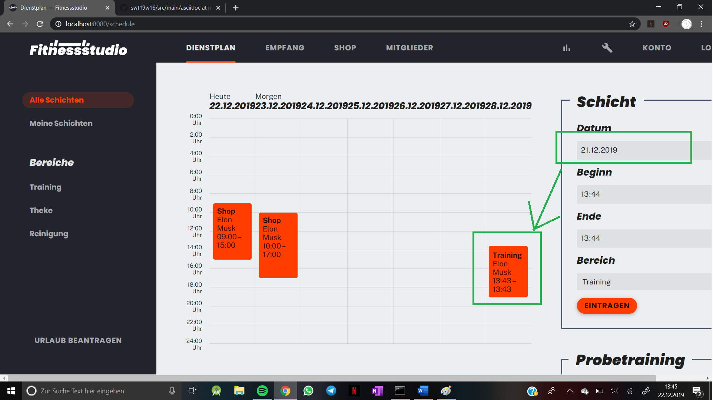
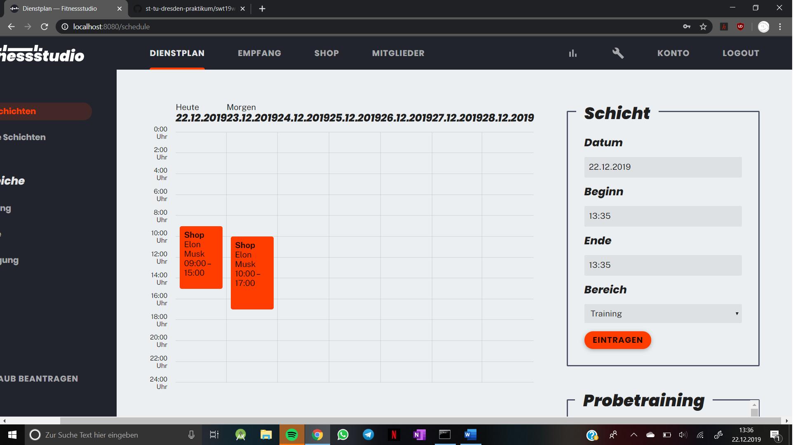

= Cross-Testing Feedback

__Durchführende Gruppe:__ 16
__Anwendung von Gruppe:__ 12

== Getestetes System
Welche Aufgabe/Problemstellung löst die Anwendung.

.Verträge
* können erstellt und bearbeitet werden
* müssen beim Registrieren ausgewählt werden

.Kunden
* Registrierung
* Log in/out
* Daten ändern (mit kleinen Error)
* Guthaben einsehbar
* manuelles Aufladen von Guthaben

.Training
* (Probe-)Trainings können angefragt werden
* Mitglieder haben eine Übersicht über ihre Trainings
* Trainings können  bearbeitet und gelöscht werden

== Fehlende Features
.Training
* Probetrainings können nicht abgelehnt werden
* Probetrainings können nur vom Boss angenommen werden? (Kunde: harald@email.com, Mitarbeiter: hans@email.com)
* Da Probetraining einen Trainer vorsieht, wieso ein normales Training nicht?

.Kunden
* Pausierung wird nach einem Monat nicht aufgehoben

.Verträge
* Vertragslaufzeit fehlt bzw. nicht ersichtlich

== Fehler-Report
// See http://asciidoctor.org/docs/user-manual/#tables
[options="header"]
|===
|Pfad |Parameter |Beschreibung |Rückgabe
| Konto | franz@email.com1 | Beim Ändern der Kundendaten wird man auf die Hauptseite geleitet und das Konto ist nicht
mehr einsehbar. Jedoch wird die Email erfolgreich geändert. | (Konsole ohne Errors)
|profiles| boss@email.com, hans@email.com| Mitarbeiter und Boss haben eine "Kundennummer". Nur Schönheitsfehler :D|
|schedule| Start 13:45, Ende 13:44| Startzeit nach Endzeit | Whitelabel Error Page (System kennt das Problem)
|schedule/holiday| Mitarbeiter stellt Antrag zu Zeit in der er bereits arbeitet| Urlaubsantrag: Wenn ein Mitarbeiter arbeitet kann er keinen Antrag stellen. (logisch) Jedoch bekommt man keine Fehlermeldung weshalb es eine Weile gedauert hat herauszufinden woran es lag|
|schedule|21.12.2019 (am 22.12.2019)|Wenn man Datum bei der Schichterstellung in der Vergangenheit stellt, wird der Eintrag in der Zukunft erstellt. Der Eintrag hat bei den Details das richtige Datum gespeichert, jedoch wird er falsch angezeigt. Wenn der Tag bereits 2 Tage vorbei ist, wird der Eintrag am in der zweiten Spalte von hinten eingetragen. Beispiel: Datum 21.12.2019:

|

|schedule|01.01.2020 (am 22.12.2019) | Das gleiche geht auch in die andere Richtung (Datum in der Zukunft außerhalb des Dienstplans wird vermutlich mod 7 eingefügt)|
|schedule||Bei 100% kann man das Probetraining nicht sehen:

|
|schedule|Start 13:45, Ende 13:46| Dienstplaneinträge (zur gleichen Zeit) werden überdeckt. Wenn Zeitraum zu klein (z.b. 12:00-12:01) stimmt die Größe im Dienstplan nicht. (Da man es sonst natürlich überhaupt nicht sehen könnte)|
|schedule/shift/15| Start 20:00, Ende 17:00| Startzeit nach Endzeit | White Label Error Page mit "Start must be before or equal to end"

|===

== Sonstiges
* Optik der Anwendung
* Interaktion mit der Anwendung (Usability)

== Verbesserungsvorschläge
* Was kann noch weiter verbessert werden?
