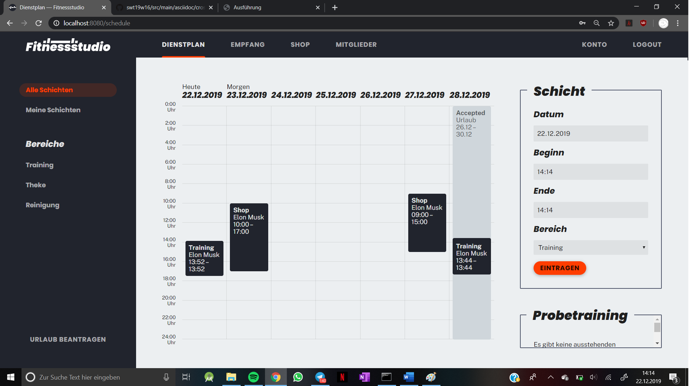
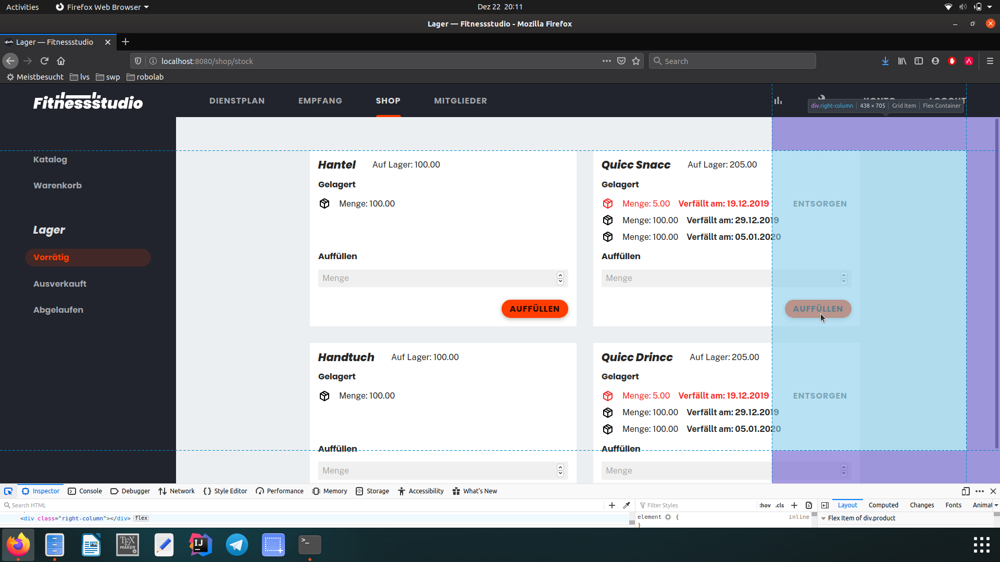
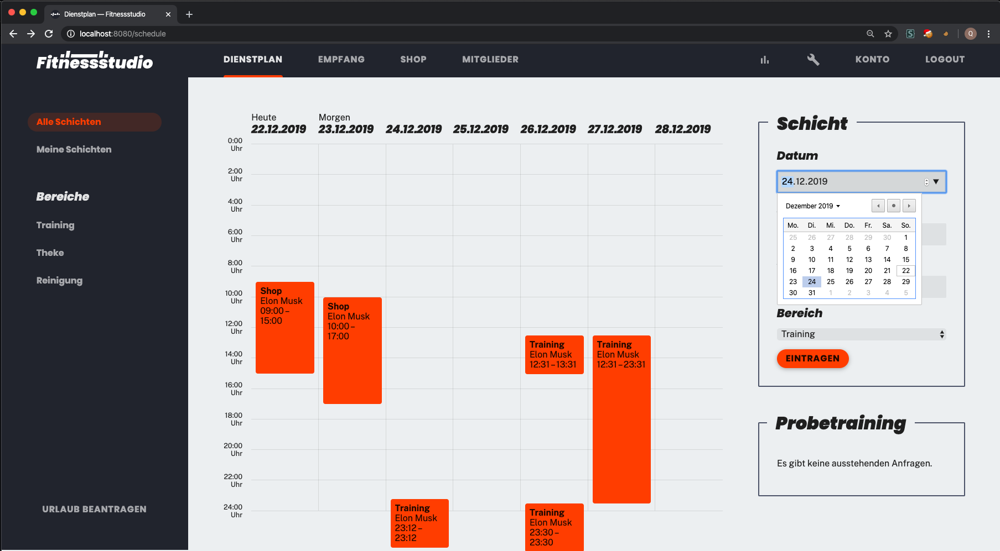
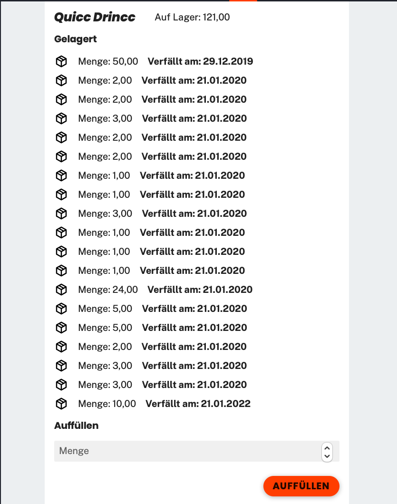

= Cross-Testing Feedback

__Durchführende Gruppe:__ 16
__Anwendung von Gruppe:__ 12

== Getestetes System
Welche Aufgabe/Problemstellung löst die Anwendung.

.Dienstplan
* Zeigt die Aufgabenverteilung für die nächsten 7 Tage.
* Urlaube und Schichten werden dargestellt
* Schichten können bearbeitet werden

.Verträge
* können erstellt und bearbeitet werden
* müssen beim Registrieren ausgewählt werden

.Kunden
* Registrierung
* Log in/out
* Daten ändern (mit kleinen Error)
* Guthaben einsehbar
* manuelles Aufladen von Guthaben

.Training
* (Probe-)Trainings können angefragt werden
* Mitglieder haben eine Übersicht über ihre Trainings
* Trainings können  bearbeitet und gelöscht werden

.Shop
* Verkauf von Artikeln
* Zwischenspeichern durch einen Warenkorb
* Verkauf durch drei Zahlungsarten
* optionale Mindesthaltbarkeitsdaten
* Auflistung der Artikel, der nachzubestellenden Artikel und abgelaufenen Artikel sowie Entfernen Letzterer

== Fehlende Features
.Training
* Probetrainings können nicht abgelehnt werden
* Probetrainings können nur vom Boss angenommen werden? (Kunde: harald@email.com, Mitarbeiter: hans@email.com)
* Da Probetraining einen Trainer vorsieht, wieso ein normales Training nicht?

.Kunden
* Pausierung wird nach einem Monat nicht aufgehoben

.Verträge
* Vertragslaufzeit fehlt bzw. nicht ersichtlich

.Guthaben
* Boss/Mitarbeiter kann das Guthaben des Mitglieds nicht aufladen?

.PDF
* Wo ist die Rechnung als PDF für Kunden?

.Shop
* Artikel können nicht bearbeitet, entfernt oder hinzugefügt werden
* Rabatte haben keinen bestimmten Zeitraum

== Fehler-Report
// See http://asciidoctor.org/docs/user-manual/#tables
[options="header"]
|===
|Pfad |Parameter |Beschreibung |Rückgabe

| Konto | franz@email.com1 | Beim Ändern der Kundendaten wird man auf die Hauptseite geleitet und das Konto ist nicht
mehr einsehbar. Jedoch wird die Email erfolgreich geändert. | (Konsole ohne Errors)
|profiles| boss@email.com, hans@email.com| Mitarbeiter und Boss haben eine "Kundennummer". Nur Schönheitsfehler :D|
|schedule| Start 13:45, Ende 13:44| Startzeit nach Endzeit | Whitelabel Error Page (System kennt das Problem)
|schedule/holiday| Mitarbeiter stellt Antrag zu Zeit in der er bereits arbeitet| Urlaubsantrag: Wenn ein Mitarbeiter arbeitet kann er keinen Antrag stellen. (logisch) Jedoch bekommt man keine Fehlermeldung weshalb es eine Weile gedauert hat herauszufinden woran es lag|
|schedule|21.12.2019 (am 22.12.2019)|Wenn man Datum bei der Schichterstellung in der Vergangenheit stellt, wird der Eintrag in der Zukunft erstellt. Der Eintrag hat bei den Details das richtige Datum gespeichert, jedoch wird er falsch angezeigt. Wenn der Tag bereits 2 Tage vorbei ist, wird der Eintrag am in der zweiten Spalte von hinten eingetragen. Beispiel: Datum 21.12.2019:

image:crosstesting/dienstplan_schicht_vergangenheit.png[]|

|schedule|01.01.2020 (am 22.12.2019) | Das gleiche geht auch in die andere Richtung (Datum in der Zukunft außerhalb des Dienstplans wird vermutlich mod 7 eingefügt)|
|schedule||Bei 100% kann man das Probetraining nicht sehen:

image:crosstesting/dienstplan_probetraining.png[]
|
|schedule|Start 13:45, Ende 13:46| Dienstplaneinträge (zur gleichen Zeit) werden überdeckt. Wenn Zeitraum zu klein (z.b. 12:00-12:01) stimmt die Größe im Dienstplan nicht. (Da man es sonst natürlich überhaupt nicht sehen könnte)|
|schedule/shift/15| Start 20:00, Ende 17:00| Startzeit nach Endzeit | White Label Error Page mit "Start must be before or equal to end"
|schedule| Urlaubs (akzeptiert von 26.12.2019-30.12.2019, 22.12.2019)| Wird am 28.12.2019 angezeigt?

|
| registrieren |Kundennummer = 12|Anwerbungsprämie wird auf Kundenkonto des Mitglieds nicht gutgeschrieben, wenn man mit Kundennummer vom Anwerber erfolgreich registriert hat|-
|Shop| Anzahl |
durch mehrmaliges hinzufügen, können mehr Items im Warenkorb liegen als vorhanden sind,
| white label error page beim auschecken

|Shop|Anzahl| mehrer Mitarbeiter gleichzeitig ein Item verkaufen wollen, so wird, falls Vorrat nur
für den ersten Verkauf reichen sollte, ausschecken durch den zweiten eine Exception auftreteny|
white label error page mit exception

|Shop|Summe: 200, Guthaben = 0 | Wenn man nicht erfolgreich auschecken kann, wird der Vorrat aber noch geändert, die abgeschlossenen Bestellungen werden noch im Kundenkonto angezeigt und das Guthaben des Kundenkontos wird abgezogen|

|shop/stock ||ist man als Boss angemeldet überschneidet die rechte column den "Auffüllen" Button, sodass dieser nicht mehr geklickt werden kann:
|

|statistics/customer ||in den Statistiken können für einen Kunden mehrere checkins nacheinander angezeigt werden |

|desk |Kundennummer = 12 |Ist ein Mitglied deaktiviert, kann es trotzdem eingecheckt werden. Kann aber auch gewünscht sein.|

|shop/cart|Kundennummer = 2| Wenn die externe zufällige Kundennummer eingegeben wird, bekommt man White label error page.|white label error 500 page |

schedule|Datum = 24.12.2019| Man muss nur immer Datum als Input mit Format yyyy-MM-dddd eingeben. D.h wenn man in Chrome(oder andere Browser mit Date-Integration-Format in Inputfeld), bekommt man White label error page.
|white label error 500 page oder Text '' could not be parsed at index 0|

|===

== Sonstiges
* Optik der Anwendung
** sehr schick
* Interaktion mit der Anwendung (Usability)
** sehr gut verständliche Menüführung

== Verbesserungsvorschläge
* Die Mitarbeiter sollen noch Rabatte verwalten können
* auch englische Browser berücksichtigen, sodass die Eingabe von Datum und Zeit nicht zu einem Internal Server Error führt
* mehrere Menge aber gleiches MHD in verschiedene Zeilen anzeigen. Wozu?
|
