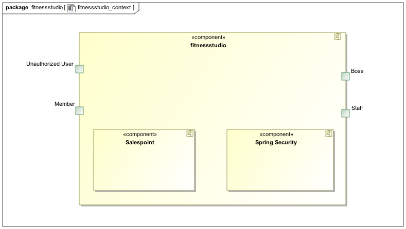
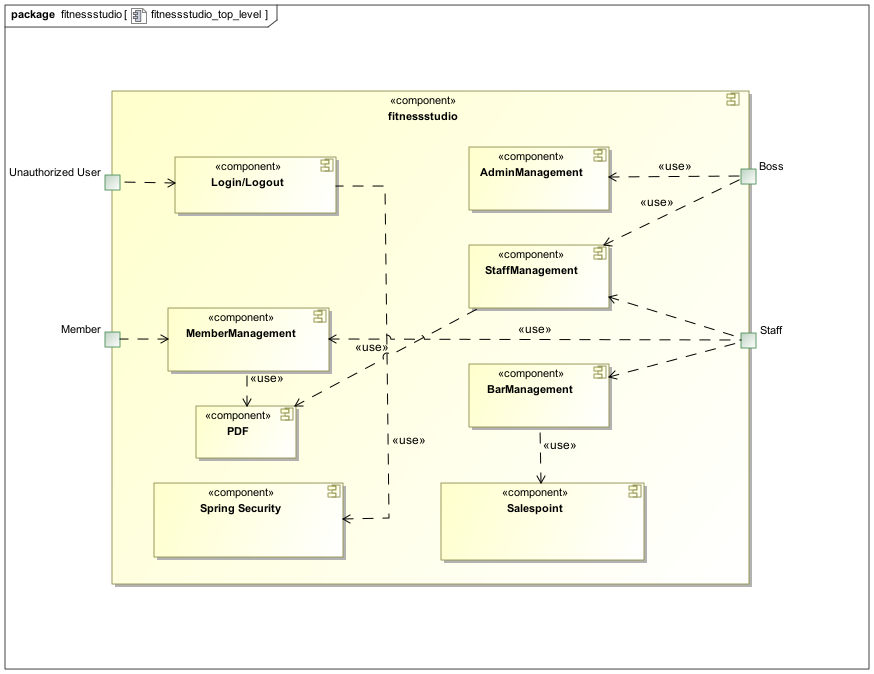
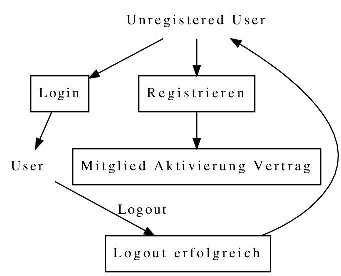
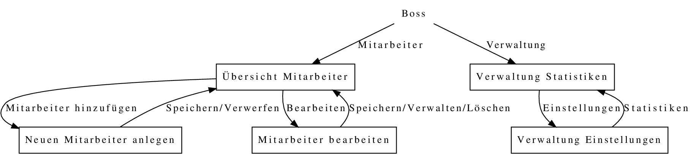
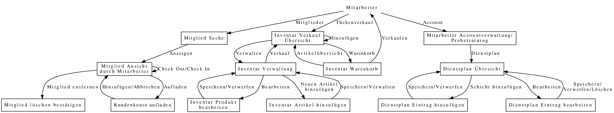
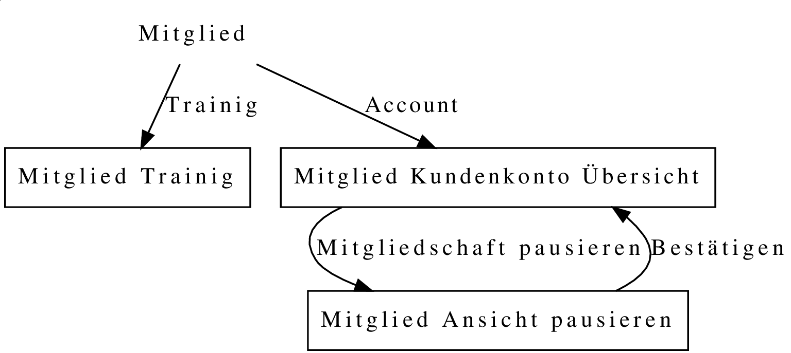
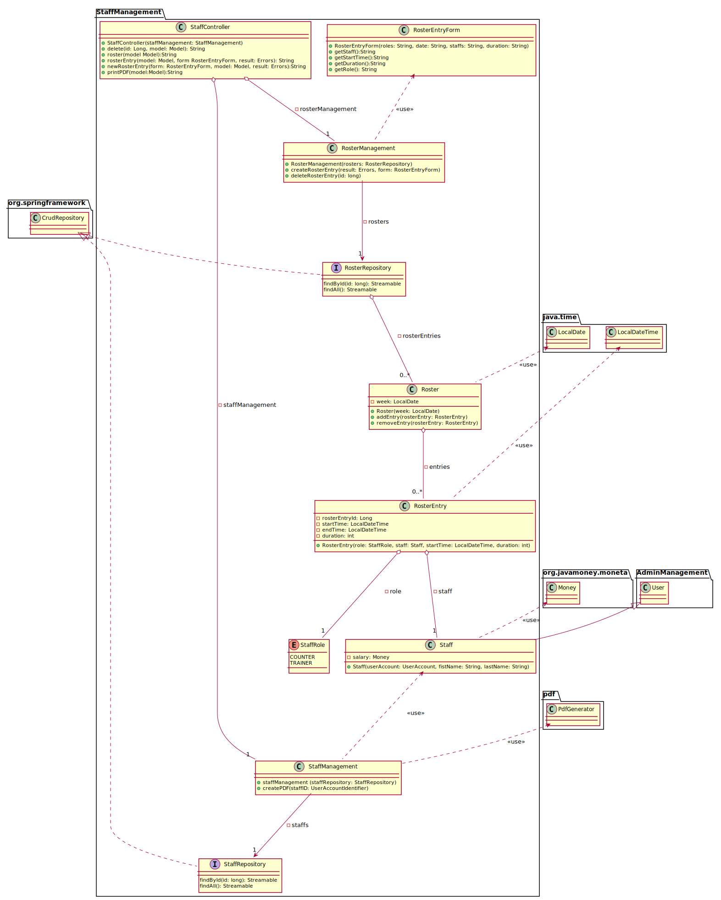

[options="header"]
[cols="1, 3, 3"]
|===
|Version | Bearbeitungsdatum   | Autor 
|v1.0	| 11.11.2019  | Julius Schmitt, Bill Kippe, Markus Wieland, Quang Vu Ha, Lea Häusler
|===

= Entwicklerdokumentation

== Einführung und Ziele

=== Aufgabenstellung
Es soll eine Software für den Einsatz in einem Fitnessstudio entwickelt werden. Dabei sollen verschiedene
Geschäftsfelder berücksichtigt werden. In der Mitarbeiterverwaltung können die Mitarbeiter(_Staff_) des Fitnessstudios eingestellt,
bearbeitet und entlassen werden. Die Mitarbeiter haben verschiedene Aufgaben (Thekenkraft/Trainer) und Löhne.

Zum Monatsende wird für jeden Mitarbeiter ein Lohnschein (_Payslip_) als PDF erstellt. Die Mitarbeiter sollen einen eigenen Login (_Login_) bekommen,
um den Dienstplan (_Roster_) zu betrachten und den Lohnschein abzurufen. Der Dienstplan muss ebenfalls von Mitarbeitern erstellt
und bearbeitet werden können.

Es sollen ebenfalls alle Mitglieder (_Customer_) verwaltet werden können. Diese können in das Studio aufgenommen, bearbeitet und entlassen werden.
Um als Mitglied aufgenommen zu werden muss ein Vertrag abgeschlossen werden. +
Bei der Aufnahme (_Registrierung_) soll ein Log-in erstellt werden, mit dem der Kunde von zu Hause aus persönliche Daten, Vertrag und Probetraining verwalten kann.
Die monatlichen Gebühren werden per SEPA-Lastschrift vom Kunden abgebucht.

Jedes Mitglied erhält einen Code (_ReferralCode_), mit dem es beliebig viele neue Mitglieder anwerben kann.
Wird dieser Code bei der Registrierung eines anderen Mitgliedes angegeben, so wird ein bestimmter Betrag auf das Kundenkonto des Codeinhabers gutgeschrieben.
Jeder Kunde kann während seiner Mitgliedschaft mit einem Trainer ein Probetraining vereinbaren,
entweder direkt im Studio oder über das Internetportal des Studios. Eine Mitgliedschaft kann pro Jahr für einen Monat
ohne Gründe ausgesetzt und später nachgeholt werden.

Des Weiteren gibt es einen Eingangs- und Verkaufsbereich (_Bar_), dort meldet sich jedes Mitglied mit seiner Kunden-ID
bei Betreten des Studios an und bei Verlassen ab. An der Theke können auch Getränke, Nahrungsergänzungsmittel
oder Zubehör (_Article_) erworben werden, diese werden bar bezahlt oder direkt vom Guthabenkonto abgebucht.
Mitglied können dann monatlich sich ihre Rechnung (_Invoice_) online als PDF ausgeben lassen.

Die Artikel des Verkaufsbereiches lassen sich ebenfalls verwalten. Es müssen Artikel hinzugefügt, bearbeitet
und gelöscht werden können. Unterschreiten Artikel die Mindestmenge, dann werden sie einer Bestellliste hinzugefügt
und für die Mitarbeiter sichtbar gemacht. +
Artikel, die für den Verzehr gedacht sind, haben ein Verfallsdatum (_expirationDate_),
welches bei jedem Programmstart überprüft wird. Für erschiedene Artikel soll man für einen bestimmten Zeitraum
einen Rabatt (_Discount_) angeben können.

Online und nur für den Chef (_Boss_) sind Statistiken (_Statistic_) über laufende Kosten, Einnahmen, Kundenverhalten und Verkaufsartikel grafisch dargestellt.
Sowie verschiedene Einstellungen wie Vertragslaufzeit, monatliche Gebühren, Einladungsprämie, Öffnungszeiten usw. verwaltbar.

=== Qualitätsziele

==== Qualitätsanforderungen
Die folgende Tabelle zeigt, welche Qualitätsanforderungen in welchem Umfang erfüllt werden müssen.
Die erste Spalte listet die Qualitätsanforderungen auf, während in den folgenden Spalten ein "x" verwendet wird, um die Priorität zu kennzeichnen.
Die zugewiesene Priorität muss bei der Formulierung der konkreten nichtfunktionalen Anforderungen berücksichtigt werden.

1 = Nicht wichtig ..
5 = Sehr wichtig
[options="header", cols="3h, ^1, ^1, ^1, ^1, ^1"]
|===
|Qualitätsanforderungen| 1 | 2 | 3 | 4 | 5
|Wartbarkeit           |   |   |   | x |
|Benutzbarkeit         |   |   | x |   |
|Effizienz             |   |   |   | x |
|Funktionalität        |   |   |   |   | x
|Übertragbarkeit       | x |   |   |   | 
|Zuverlässigkeit       |   |   | x |   |
|Sicherheit            |   |   | x |   |
|Nutzerfreundlichkeit  |   | x |   |   |
|Erreichbarkeit        |   | x |   |   |
|===

== Randbedingungen

=== Hardware - Vorgaben

Eine Liste an benötigter Hardware, welche man zur Bedienung des Systems benötigt.

* Server
* Computer
* Tastatur
* Maus
* Monitor
* Internetanschluss

=== Software - Vorgaben 

Eine Liste der Software, welche benötigt wird um die Anwendung zu benutzen.

Die folgende (oder neuere) Java Version wird benötgit:

* Java 11

Die folgende (oder neuere) Suchmaschinen-Version wird benötigt:

* Internet Explorer/ Edge 10.0
* Firefox 4.0
* Google Chrome 4.0
* Opera 9.6

=== Produktnutzung
Die Software (_System_) soll auf einem Server laufen und dabei durchgängig über das Internet mit einem Browser
(z. B. Google Chrome, Firefox oder Safari) erreichbar sein. Hauptnutzungsgebiete sind dabei die Mitarbeiterverwaltung,
die Verkaufsstelle (_Bar_) und die Mitgliederverwaltung. Alle Felder sind über die gleiche Applikation mit verschiedenen
Log-ins (_Login_) erreichbar.

Alle sich anhäufende Daten sollen dabei dauerhaft in Form einer Datenbank gespeichert werden. +
Vertrauliche Daten, wie z. B. Passwörter, sollen verschlüsselt gesichert werden. Für den Umgang mit der Datenbank wird kein technisches
Verständnis verausgesetzt, denn deren Verwaltung wird in der Website nutzerfreundlich dargestellt. 

== Kontextabgrenzung

== Lösungsstrategie
=== Erfüllung der Qualitätsziele
[options="header"]
|=== 
|Qualitätsziel |Lösungsansatz
|... |...
|===

=== Softwarearchitektur

Client Server Model

^ 
| 
| 
|

=== Entwurfsentscheidungen
* Verwendete Muster
* Persistenz
* Benutzeroberfläche
* Verwendung externer Frameworks

== User Interface

Im  folgenden wird eine Übersicht über die Dialoge des in der Webanwendung gegeben.
Jedes Rechteck stellt eine Ansicht, also ein HTML Dokument da. Zwischen diesen wird durch den
Benutzer hin und her gewechselt. Ein Pfeil stellt dabei einen Übergang in eine Richtung da.
Die Notation am Pfeil steht für den Button, welcher für den entsprechenden Übergang gedrückt wurde.
Jedes der folgenden Diagramme behandelt den Ablauf aus einer anderen Perspektive, abhängig als
was der Benutzer eingeloggt ist. Eine Rolle ohne Rechteckt beschreibt eine beliebige Ansicht der
betreffenden Rolle. Zu beachten ist, dass alle Optionen des _staff_ auch für den _boss_ gelten.

Dialogoptionen eines _unregistered_user_

Dialogoptionen eines _boss_

Dialogoptionen eines _staff_

Dialogoptionen eines _member_

== _TODO
[options="header", cols="1,3,3"]
|===
|Externe Klasse |Pfad der externen Klasse |Verwendet von (Klasse der eigenen Anwendung)
|... |... |...
|===

== Bausteinsicht
* Entwurfsklassendiagramme der einzelnen Packages

=== StaffManagement Package ===

[options="header"]
|=== 
|Klasse/Enumeration | Beschreibung
|StaffController | Ein Spring MVC Controller, welcher Anfragen auf den Dienstplan und Lohnschein bearbeitet.
|RosterEntryForm | Ein Interface, um die Eingaben des Mitarbeiters zu bearbeiten/validieren.
|RosterManagement | Eine Klasse, mit der man aus den Eingaben eines Mitarbeiters ein _RosterEntry_ erzeugen kann und diesen dann dort auch bearbeiten.
|RosterRepository | Ein Repository Interface zum Verwalten von RosterEntry Instanzen.
|Roster | Fässt alle _RosterEntry's_ einer Woche zusammen.
|RosterEntry | Eine Objekt um die Dienstplaneinträge im System zu verwalten.
|StallRole | Eine Enumeration für die Aufgaben, welche ein Mitarbeiter in einer Schicht erledigen kann.
|Staff| Das Objekt eines Mitarbeiters im System.
|StaffManagement | Eine Klasse um die PDFs für den Lohnschein zu erstellen und zur Verwaltung der Mitarbeiter.
|StaffRepository | Ein Repository Interface zum Verwalten von Mitarbeitern.
|===

=== Rückverfolgbarkeit zwischen Analyse- und Entwurfsmodell

[options="header"]
|===
|Klasse/Enumeration (Analysemodell) |Klasse/Enumeration (Entwurfsmodell)
|===

== Laufzeitsicht
* Komponentenbezogene Sequenzdiagramme, welche darstellen, wie die Anwendung mit externen Frameworks (zB. Salespoint, Spring) interagiert.

== Technische Schulden
* Auflistung der nicht erreichten Quality Gates und der zugehörigen SonarQube Issues

