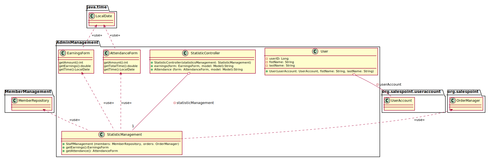
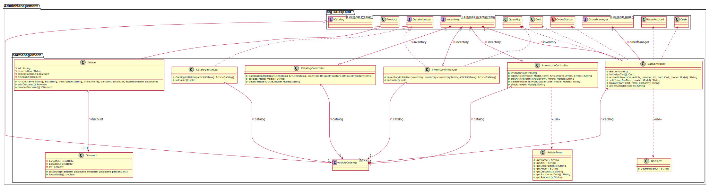
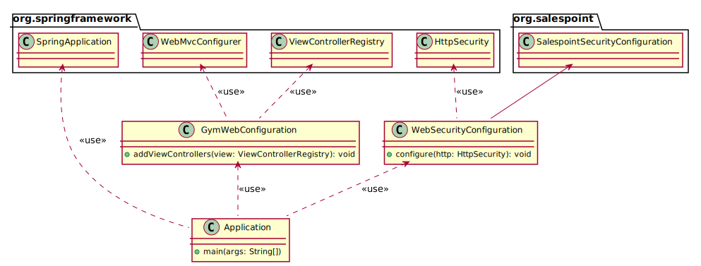
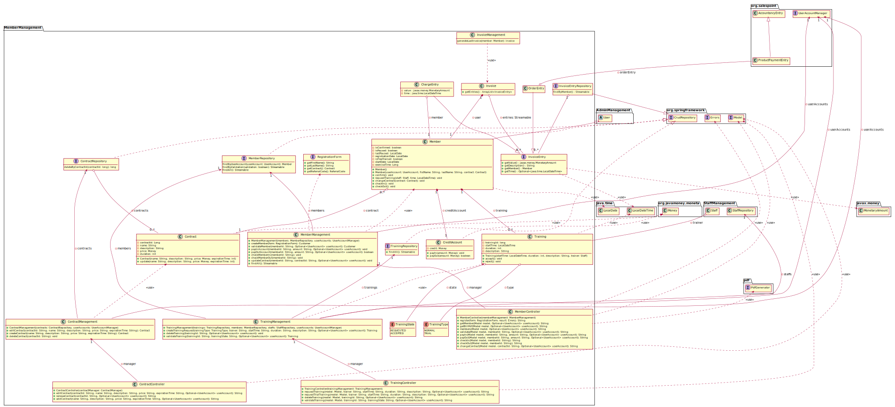
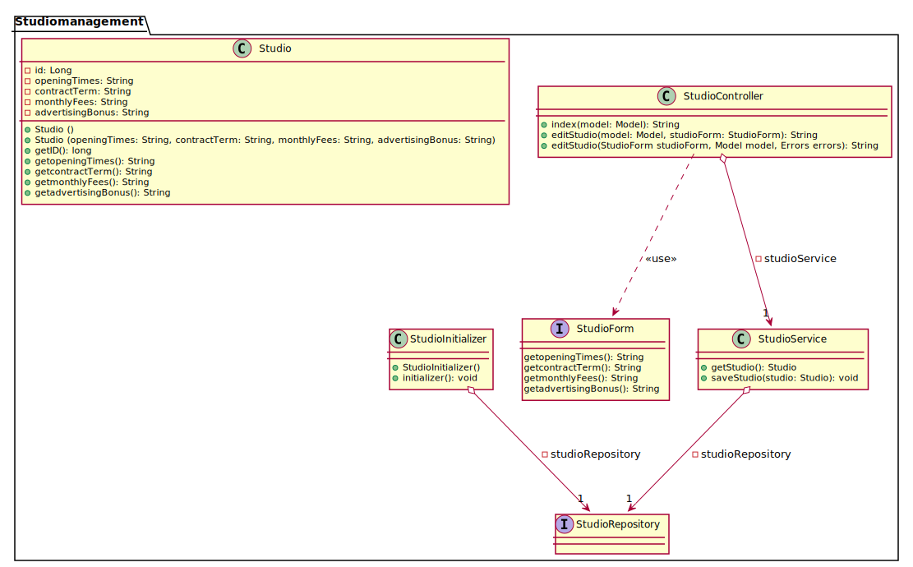

[options="header"]
[cols="1, 3, 3"]
|===
|Version | Bearbeitungsdatum   | Autor 
|v1.0	| 11.11.2019  | Julius Schmitt, Bill Kippe, Markus Wieland, Quang Vu Ha, Lea Häusler
|===

= Entwicklerdokumentation

== Einführung und Ziele

=== Aufgabenstellung
Es soll eine Software für den Einsatz in einem Fitnessstudio entwickelt werden. Dabei sollen verschiedene
Geschäftsfelder berücksichtigt werden. In der Mitarbeiterverwaltung können die Mitarbeiter(_Staff_) des Fitnessstudios eingestellt,
bearbeitet und entlassen werden. Die Mitarbeiter haben verschiedene Aufgaben (Thekenkraft/Trainer) und Löhne.

Zum Monatsende wird für jeden Mitarbeiter ein Lohnschein (_Payslip_) als PDF erstellt. Die Mitarbeiter sollen einen eigenen Login (_Login_) bekommen,
um den Dienstplan (_Roster_) zu betrachten und den Lohnschein abzurufen. Der Dienstplan muss ebenfalls von Mitarbeitern erstellt
und bearbeitet werden können.

Es sollen ebenfalls alle Mitglieder (_Customer_) verwaltet werden können. Diese können in das Studio aufgenommen, bearbeitet und entlassen werden.
Um als Mitglied aufgenommen zu werden muss ein Vertrag abgeschlossen werden. +
Bei der Aufnahme (_Registrierung_) soll ein Log-in erstellt werden, mit dem der Kunde von zu Hause aus persönliche Daten, Vertrag und Probetraining verwalten kann.
Die monatlichen Gebühren werden per SEPA-Lastschrift vom Kunden abgebucht.

Jedes Mitglied erhält einen Code (_ReferralCode_), mit dem es beliebig viele neue Mitglieder anwerben kann.
Wird dieser Code bei der Registrierung eines anderen Mitgliedes angegeben, so wird ein bestimmter Betrag auf das Kundenkonto des Codeinhabers gutgeschrieben.
Jeder Kunde kann während seiner Mitgliedschaft mit einem Trainer ein Probetraining vereinbaren,
entweder direkt im Studio oder über das Internetportal des Studios. Eine Mitgliedschaft kann pro Jahr für einen Monat
ohne Gründe ausgesetzt und später nachgeholt werden.

Des Weiteren gibt es einen Eingangs- und Verkaufsbereich (_Bar_), dort meldet sich jedes Mitglied mit seiner Kunden-ID
bei Betreten des Studios an und bei Verlassen ab. An der Theke können auch Getränke, Nahrungsergänzungsmittel
oder Zubehör (_Article_) erworben werden, diese werden bar bezahlt oder direkt vom Guthabenkonto abgebucht.
Mitglied können dann monatlich sich ihre Rechnung (_Invoice_) online als PDF ausgeben lassen.

Die Artikel des Verkaufsbereiches lassen sich ebenfalls verwalten. Es müssen Artikel hinzugefügt, bearbeitet
und gelöscht werden können. Unterschreiten Artikel die Mindestmenge, dann werden sie einer Bestellliste hinzugefügt
und für die Mitarbeiter sichtbar gemacht. +
Artikel, die für den Verzehr gedacht sind, haben ein Verfallsdatum (_expirationDate_),
welches bei jedem Programmstart überprüft wird. Für erschiedene Artikel soll man für einen bestimmten Zeitraum
einen Rabatt (_Discount_) angeben können.

Online und nur für den Chef (_Boss_) sind Statistiken (_Statistic_) über laufende Kosten, Einnahmen, Kundenverhalten und Verkaufsartikel grafisch dargestellt.
Sowie verschiedene Einstellungen wie Vertragslaufzeit, monatliche Gebühren, Einladungsprämie, Öffnungszeiten usw. verwaltbar.

=== Qualitätsziele

==== Qualitätsanforderungen
Die folgende Tabelle zeigt, welche Qualitätsanforderungen in welchem Umfang erfüllt werden müssen.
Die erste Spalte listet die Qualitätsanforderungen auf, während in den folgenden Spalten ein "x" verwendet wird, um die Priorität zu kennzeichnen.
Die zugewiesene Priorität muss bei der Formulierung der konkreten nichtfunktionalen Anforderungen berücksichtigt werden.

1 = Nicht wichtig ..
5 = Sehr wichtig
[options="header", cols="3h, ^1, ^1, ^1, ^1, ^1"]
|===
|Qualitätsanforderungen| 1 | 2 | 3 | 4 | 5
|Wartbarkeit           |   |   |   | x |
|Benutzbarkeit         |   |   | x |   |
|Effizienz             |   |   |   | x |
|Funktionalität        |   |   |   |   | x
|Übertragbarkeit       | x |   |   |   | 
|Zuverlässigkeit       |   |   | x |   |
|Sicherheit            |   |   | x |   |
|Nutzerfreundlichkeit  |   | x |   |   |
|Erreichbarkeit        |   | x |   |   |
|===

== Randbedingungen

=== Hardware - Vorgaben

Eine Liste an benötigter Hardware, welche man zur Bedienung des Systems benötigt.

* Server
* Computer
* Tastatur
* Maus
* Monitor
* Internetanschluss

=== Software - Vorgaben 

Eine Liste der Software, welche benötigt wird um die Anwendung zu benutzen.

Die folgende (oder neuere) Java Version wird benötgit:

* Java 11

Die folgende (oder neuere) Suchmaschinen-Version wird benötigt:

* Internet Explorer/ Edge 10.0
* Firefox 4.0
* Google Chrome 4.0
* Opera 9.6

=== Produktnutzung
Die Software (_System_) soll auf einem Server laufen und dabei durchgängig über das Internet mit einem Browser
(z. B. Google Chrome, Firefox oder Safari) erreichbar sein. Hauptnutzungsgebiete sind dabei die Mitarbeiterverwaltung,
die Verkaufsstelle (_Bar_) und die Mitgliederverwaltung. Alle Felder sind über die gleiche Applikation mit verschiedenen
Log-ins (_Login_) erreichbar.

Alle sich anhäufende Daten sollen dabei dauerhaft in Form einer Datenbank gespeichert werden. +
Vertrauliche Daten, wie z. B. Passwörter, sollen verschlüsselt gesichert werden. Für den Umgang mit der Datenbank wird kein technisches
Verständnis verausgesetzt, denn deren Verwaltung wird in der Website nutzerfreundlich dargestellt. 

== Kontextabgrenzung
image:models/analysis/fitnessstudio_context.svg[fitnessstudio_context]

== Lösungsstrategie

=== Erfüllung der Qualitätsziele
[options="header"]
|=== 
|Qualitätsziel |Lösungsansatz
|Zuverlässigkeit|Um die Zuverlässigkeit des Systems zu gewährleisten schreiben wir Anwendungs- und Akzeptanztests. So können Fehler leichter erkannt und die Zuverlässigkeit gewährleistet werden.
|Betriebszeit|Das System soll nur zu kurzen Wartungszeiten offline genommen werden. Sonst soll das System immer erreichbar sein. 
|Sicherheit| Die Daten der Nutzer sollen sicher verschlüsselt gespeichert werden.
|Effizienz|Der Code soll effizient sein. Redundanzen sollen vermieden werden, dass eine hohe Geschwindigkeit gewährleistet wird.
|Funktionalität|Das System soll niemals abstürzen und alle Funktionen soll richtig funktionieren.
|===

=== Softwarearchitektur
image::models/analysis/fitnessstudio_top_level.svg[fitnessstudio_top_level]

_Top Level Architektur_

image::models/design/ClientServerModel.jpg[]

_Client Server Model_

== Entwurfsentscheidungen
=== Verwendete Muster

* Spring MVC

=== Persistenz

Die Anwendung verwendet *Hibernate annotation based mapping*. Damit lassen sich Java Klassen in Datenbank-Tabellen umwandeln. Derzeit ist die Persistenz deaktiviert. Zum Aktivieren des persistenten Speichers, muss der Kommentar der folgende zwei Zeilen in der Datei _application.properties_ entfernt werden. 

....
# spring.datasource.url=jdbc:h2:./db/videoshop
# spring.jpa.hibernate.ddl-auto=update
....

=== Benutzeroberfläche

Im  folgenden wird eine Übersicht über die Dialoge des in der Webanwendung gegeben.
Jedes Rechteck stellt eine Ansicht, also ein HTML Dokument da. Zwischen diesen wird durch den
Benutzer hin und her gewechselt. Ein Pfeil stellt dabei einen Übergang in eine Richtung da.
Die Notation am Pfeil steht für den Button, welcher für den entsprechenden Übergang gedrückt wurde.
Jedes der folgenden Diagramme behandelt den Ablauf aus einer anderen Perspektive, abhängig als
was der Benutzer eingeloggt ist. Eine Rolle ohne Rechteckt beschreibt eine beliebige Ansicht der
betreffenden Rolle. Zu beachten ist, dass alle Optionen des _staff_ auch für den _boss_ gelten.

Dialogoptionen eines _unregistered_user_

Dialogoptionen eines _boss_

Dialogoptionen eines _staff_

image::models/analysis/Mitarbeiter.png[]

Dialogoptionen eines _member_

image::models/analysis/Mitglied.png[]

=== Verwendung externer Frameworks

[options="header", cols="1,3,3"]
|===
|Externe Klasse |Pfad der externen Klasse |Verwendet von (Klasse der eigenen Anwendung)
|itextpdf | com.itextpdf a| 
* pdf.PDFView
* pdf.PDFGenerator
* pdf.PaySlipGenerator
* pdf.InvoiceGenerator
|Salespoint.useraccount | org.salespointframework.useraccount.UserAccount a|
* Adminmanagement.User
* Barmanagement.BarController
|Salespoint.OrderManager | org.salespointframework.order.OrderManager a|
* Adminmanagement.StatisticManagement
* Barmanagement.BarController
|Salespoint.Product | org.salespointframework.catalog.Product a|
* Barmanagement.Article
|Salespoint.Cash | org.salespointframework.payment.Cash a|
* Barmanagement.BarController
|Salespoint.Cart | org.salespointframework.order.Cart a|
* Barmanagement.BarController
|Salespoint.OrderStatus | org.salespointframework.order.OrderStatus a|
* Barmanagement.BarController

|Salespoint.Quantity | org.salespointframework.quantity.Quantity a|
* Barmanagement.BarController
|Salespoint.DataInitializer | org.salespointframework.core.DataInitializer a|
* Barmanagement.BarController
|Salespoint.Inventory | org.salespointframework.inventory.UniqueInventory a|
* Barmanagement.BarController
|Salespoint.Catalog | org.salespointframework.catalog.Catalog a|
* Barmanagement.BarController

|Spring.SpringApplication |org.springframework.boot.SpringApplication a|
* gym.Application
|Spring.ViewControllerRegistry |org.springframework.web.servlet.config.annotation.ViewControllerRegistry  a| 
* gym.GymWebConfiguration
|Spring.WebMvcConfigurer |org.springframework.web.servlet.config.annotation.WebMvcConfigurer  a| 
* gym.WebSecurityConfiguration
|Spring.HttpSecurity |org.springframework.security.config.annotation.web.builders.HttpSecurity a| 
* gym.WebSecurityConfiguration
|Salespoint.SalespointSecurityConfiguration |org.salespointframework.SalespointSecurityConfiguration a| 
* videoshop.WebSecurityConfiguration

|Spring.CrudRepository |org.springframework.data.repository.CrudRepository a|
* membermanagement.InvoiceEntryRepository
* membermanagement.MemberRepository
* membermanagement.TrainingRepository
|Spring.Errors |org.springframework.validation.Errors |
* membermanagement.MemberController
|Spring.Model |org.springframework.ui.Model a|
* membermanagement.MemberController
* membermanagement.TrainingController
* membermanagement.ContractController
|Salespoint.UserAccountManager |org.salespointframework.useraccount.UserAccountManager a|
* membermanagement.Membermanagement
* membermanagement.TrainingManagement
* membermanagement.ContractManagement
|Spring.AbstractView|org.springframework.web.servlet.view.AbstractView a|
* pdf.PdfView
|===

== Bausteinsicht

=== AdminManagement Package 

[options="header"]
|=== 
|Klasse/Enumeration | Beschreibung
|StatisticManagement | Eine Klasse für die Verwaltung und Analyse von Statistiken.
|EarningsForm | Eine Klasse, um die Einnahmen des Studios zu bearbeiten/validieren.
|AttendanceForm | Eine Klasse, um die Anwesenheit von Nutzern zu bearbeiten/validieren.
|StatisticController | Ein Spring MVC Controller, welcher Anfragen auf die Statistiken bearbeitet.
|User | Eine Klasse um einen User im System zu repräsentieren.
|===

=== BarManagement Package

[options="header"]
|=== 
|Klasse/Enumeration | Beschreibung
|Article | Eine Klasse, welche einen Artikel des Fitnessstudios im System repräsentiert.
|Discount | Eine Klasse, welche Rabatte im Fitnessstudios repräsentiert.
|BarController | Ein Spring MVC Controller, welcher Käufe im Fitnessstudio verwaltet.
|InventoryInitializer | Eine Klasse, welche Einträge in das Inventar initializiert (beim Start des Systems).
|CatalogInitializer | Eine Klasse, welche Einträge in den Katalog initializiert (beim Start des Systems).
|ArticleCatalog | Ein Interface, zum Verwalten von Katalogeinträgen.
|InventoryController | Ein Spring MVC Controller, welcher Einträge im Inventar verwaltet. 
|CatalogController | Ein Spring MVC Controller, welcher Einträge im Inventar verwaltet. 
|ArticleForm | Eine Klasse, um die Eingaben im System für einen Artikel zu bearbeiten/validieren.
|BarForm | Eine Klasse, um den Nutzer im System zu bekommen.
|===

=== Gym Package 

[options="header"]
|=== 
|Klasse/Enumeration | Beschreibung
|Application | Zentrale Klasse des Systems.
|GymWebConfiguration  | Klasse um den Pfad "/login" direkt zu dem Template login.html zu führen.
|WebSecurityConfiguration|Konfigurationsklasse um zentrale Sicherheit und Login/Logout Optionen.
|===

=== MemberManagement Package

[options="header"]
|=== 
|Klasse/Enumeration | Beschreibung
|ContractRepository| Ein Interface, um Vertrags-Instanzen zu speichern und zu verwalten.
|ContractManagement| Eine Klasse, um Verträge zu verwalten.
|ContractController |Ein Spring MVC Controller, welcher Vertragsänderungen in der Anwendung verwaltet.
|MemberRepository | Ein Interface, um Mitglieder Instanzen zu speichern/verwalten.
|Contract| Eine Klasse, welche die Verträge im System repräsentiert.
|TrainingsManagement | Eine Klasse um Trainingseinträge zu bearbeiten.
|MemberManagement | Eine Klasse, um Mitgliederdaten zu bearbeiten.
|RegistrationForm | Eine Klasse, um Eingaben eines neuen Mitglieds im System im System zu erhalten.
|InvoiceManagement| Eine Klasse, welche Rechnungen von Mitgliedern bearbeitet und verwaltet.
|Invoice| Eine Klasse, welche Rechnungen einens Mitglieds repräsentiert.
|ChargeEntry| Eine Klasse, welche Aufladungen auf das Guthabenkonto repräsentiert.
|Member | Eine Klasse, welche Mitglieder im System repräsentieren.
|TrainingRepository| Ein Interface, um Training Instanzen zu speichern/verwalten.
|CreditAccount| Eine Klasse, welche ein Guthabenkonto eines Nutzers im System repräsentiert.
|TrainingState| Eine Enumeration, welche den aktuellen Status der Anfrage auf ein Training repräsentiert.
|TrainingType| Eine Enumeration, welche die verschiedenen Arten eines Trainings repräsentiert.
|TrainingController| Ein Spring MVC Controller, welcher Trainingsänderungen in der Anwendung verwaltet.
|OrderEntry| Eine Klasse, welche Bestellungseinträge im System repräsentiert.
|InvoiceEntryRepository| Ein Interface, um Rechnungseinträge Instanzen zu speichern/verwalten.
|InvoiceEntry| Eine Klasse, welche Rechnungseinträge im System repräsentiert.
|Training| Eine Klasse, welche Trainings im System repräsentiert.
|MemberController | Ein Spring MVC Controller, welcher Mitgliederänderungen in der Anwendung verwaltet.

|===

=== StaffManagement Package

[options="header"]
|=== 
|Klasse/Enumeration | Beschreibung
|StaffController | Ein Spring MVC Controller, welcher Anfragen auf den Dienstplan und Lohnschein bearbeitet.
|RosterEntryForm | Eine Klasse, um die Eingaben des Mitarbeiters zu bearbeiten/validieren.
|RosterManagement | Eine Klasse, mit der man aus den Eingaben eines Mitarbeiters ein _RosterEntry_ erzeugen kann und diesen dann dort auch bearbeiten.
|RosterRepository | Ein Repository Interface zum Verwalten von RosterEntry Instanzen.
|Roster | Fässt alle _RosterEntry's_ einer Woche zusammen.
|RosterEntry | Eine Objekt um die Dienstplaneinträge im System zu verwalten.
|StallRole | Eine Enumeration für die Aufgaben, welche ein Mitarbeiter in einer Schicht erledigen kann.
|Staff| Das Objekt eines Mitarbeiters im System.
|StaffManagement | Eine Klasse um die PDFs für den Lohnschein zu erstellen und zur Verwaltung der Mitarbeiter.
|StaffRepository | Ein Repository Interface zum Verwalten von Mitarbeitern.
|===

=== PDF Package

image::models/design/pdf.svg[]

[options="header"]
|=== 
|Klasse/Enumeration | Beschreibung
|PdfGenerator| Ein Interface, um verschiedene PDFs erzeugen zu können. 
|PdfView|Eine Klasse, welche das PDF zeigt.
|PaySlipPdfGenerator| Eine Klasse, welche Lohnschein PDfs erstellt.
|InvoicePdfGenerator| Eine Klasse, welche Rechnung PDFs erstellt.
|===

=== StudioManagnement Package

[options="header"]
|=== 
|Klasse/Enumeration | Beschreibung
|Studio | Eine Klasse, welche ein Studio im System repräsentiert.
|StudioRepository | Ein Interface, um Studio Instanzen zu speichern/verwalten.
|StudioService | Eine Klasse, zum logischen Verwaltung des Studiorepositories.
|StudioInitializer | Eine Klasse, welche Einträge in das Studio initializiert (beim Start des Systems).
|StudioController | Ein Interface, zum Verwalten von globalen Variablen des Fitnessstudios. 
|StudioForm | Eine Klasse, um die Eingaben im System für die globalen Variablen des Fitnessstudios zu bearbeiten.
|===

=== Rückverfolgbarkeit zwischen Analyse- und Entwurfsmodell

[options="header"]
|===
|Klasse/Enumeration (Analysemodell) |Klasse/Enumeration (Entwurfsmodell)
|Role|staffmanagement.StaffRole
|Member|memberManagement.Member
|TrainingType | memberfmanagement.TrainingType
|TrainingSchedule | membermanagment.Training
|Staff| staffmanagement.Staff
|Person | adminmanagement.User
|Roster| staffmanagement.Roster
|Invoice | barmanagement.Invoice
|Article | barmanagement.Article
|Account | membermanagement.CreditAccount
|Bar|barmanagement.BarController
|Payslip|barmanagement.StaffController
|Statistics|adminmanagement.StatisticController
|===

== Laufzeitsicht

=== AdminManagement

=== BarManagement

=== MemberManagement

=== StaffManagement

== Technische Schulden
* Auflistung der nicht erreichten Quality Gates und der zugehörigen SonarQube Issues

