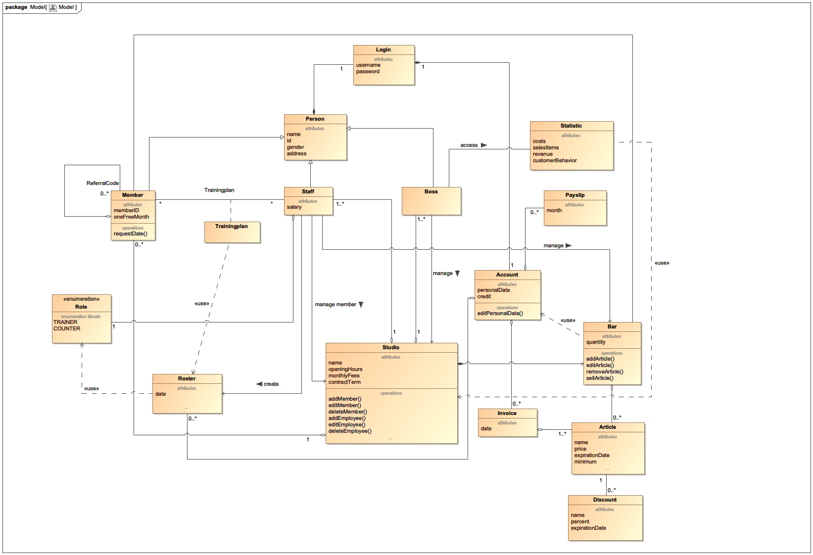

= Pflichtenheft
:project_name: Projektname
== __{project_name}__

[options="header"]
[cols="1, 1, 1, 1, 4"]
|===
|Version | Status      | Bearbeitungsdatum   | Autoren(en) |  Vermerk
|0.1     | In Arbeit   | 10.10.2019          | Autor       | Initiale Version
|===

== Inhaltsverzeichnis
Dieses Dokument benötigt ein Inhaltsverzeichnis. Es existieren mehrere Einbindungsmöglichkeiten.

== Zusammenfassung
Eine kurze Beschreibung des Dokuments. Wenige Absätze.

== Aufgabenstellung und Zielsetzung
Es soll eine Software für den Einsatz in einem Fitnessstudio entwickelt werden. Dabei sollen verschiedene Geschäftsfelder berücksichtigt werden. In der Mitarbeiterverwaltung können die Mitarbeiter des Fitnessstudios eingestellt, bearbeitet und entlassen werden. Die Mitarbeiter haben verschiedene Aufgaben (Thekenkraft/Trainer) und Löhne.

Zum Monatsende wird für jeden Mitarbeiter ein Lohnschein als PDF erstellt. Die Mitarbeiter sollen einen eigenen Login bekommen, um den Dienstplan zu betrachten und den Lohnschein abzurufen. Der Dienstplan muss ebenfalls von Mitarbeitern erstellt und bearbeitet werden können.

Es sollen ebenfalls alle Mitglieder verwaltet werden können. Diese können in den Club aufgenommen, bearbeitet und entlassen werden. Bei der Aufnahme soll ein Login erstellt werden, damit der Kunde von zu Hause aus seinen nächsten Trainingstermin samt Trainingsplan nachschlagen kann, Rechnungen betrachten kann und um persönliche Daten zu ändern. Für jedes Mitglied kann ein individueller Trainingsplan durch den Trainer erstellt und als PDF ausgegeben werden. Bei der Aufnahme wird ein Vertrag abgeschlossen für den Laufzeit und monatliche Gebühren in seinem Kundenkonto festgelegt werden.

Die monatlichen Gebühren werden per Sepa-Lastschrift vom Kunden abgebucht.

Jedes Mitglied erhält einen Code mit dem es beliebig viele neue Mitglieder anwerben kann. Wird dieser Code bei der Registrierung eines anderen Mitgliedes angegeben, so wird ein bestimmter Betrag auf das Kundenkonto des Codeinhabers gutgeschrieben, welches er nur an der Theke verbrauchen kann und nicht ausgezahlt wird. Jeder Kunde kann während seiner Mitgliedschaft mit einem Trainer ein Probetraining vereinbaren, entweder direkt im Studio oder über das Internetportal des Studios. Eine Mitgliedschaft kann pro Jahr für einen Monat ohne Gründe ausgesetzt werden.

Des Weiteren gibt es einen Eingangs- und Verkaufsbereich, dort meldet sich jedes Mitglied bei Betreten des Studios an und bei verlassen ab. An der Theke können auch Getränke, Nahrungsergänzungsmittel oder Zubehör erworben werden, diese werden bar bezahlt oder direkt vom Kundenkonto abgebucht.
Am Ende des Monats wird für jeden Kunden eine Rechnung über sein Kundenkonto als PDF erstellt.

Die Artikel des Verkaufsbereiches lassen sich ebenfalls verwalten. Es müssen Artikel hinzugefügt, bearbeitet und gelöscht werden können. Bei unterschreiten der Mindestmenge werden die Artikel einer Nachbestellliste hinzugefügt und für die Mitarbeiter sichtbar gemacht. Artikel die für den Verzehr gedacht sind, haben ein Verfallsdatum, welches bei jedem Programmstart überprüft wird.
Für verschiedene Artikel soll man für einen bestimmten Zeitraum einen Rabatt angeben können.

Ebenfalls sollen Statistiken über laufende Kosten, Einnahmen, Kundenverhalten und Verkaufsartikel grafisch dargestellt werden.
Verschiedene Einstellungen wie Vertragslaufzeit, monatliche Gebühren, Neuwerbungsprämie, Öffnungszeiten usw. sollen sich einfach global verändern lassen.

== Produktnutzung
In welchem Kontext soll das System später genutzt werden? Welche Rahmenbedingungen gelten?
Zusätzlich kurze Einleitung für fachfremde Personen

== Interessensgruppen (Stakeholders)

[options="header", cols="2, ^1, 4, 4"]
|===
|Name
|Priorität (1..5)
|Beschreibung
|Ziel

|{company_name}
|5
|Der Kunde des Projekts.
a|
- Mehr Mitgliedschaften verkaufen
- Einfache Kosten-Verwaltung
- Nutzungsdaten speichern
- Inventar immer gefüllt
- Statistiken über das Kundenverhalten einsehen
- Verwaltung der Mitarbeiter

|Kunde
|4
|Der Kunde des Fitnessstudios
a|
- Planung des eigenen Trainingserfolgs
- Einfache Verwaltung der Mitgliedschaft
- Digitalisierung der Zahlung
- Einfachere Kommunikation mit dem Trainer

|Mitarbeiter
|3
|Mitarbeiter des Fitnessstudios
a|
- Einfache Verwaltung des Dienstplans
- Überblick über das Inventar

|Chef
|2
|Leiter des Fitnessstudios
a|
- Bearbeitung der Mitarbeiterdaten
- Globale Variablen leicht bearbeiten

|Entwickler
|3
|Sind für die Implementierung und spätere Wartung der Software verantwortlich.
a|
- Einfache Erweiterung mit Funktionen 
- Geringer Wartungsaufwand
- Gute debugging Mechanismen

|===

== Systemgrenze und Top-Level-Architektur

=== Kontextdiagramm
Das Kontextdiagramm zeigt das geplante Software-System in seiner Umgebung. Zur Umgebung gehören alle Nutzergruppen des Systems und Nachbarsysteme. Die Grafik kann auch informell gehalten sein. Überlegen Sie sich dann geeignete Symbole. Die Grafik kann beispielsweise mit Visio erstellt werden. Wenn nötig, erläutern Sie diese Grafik.

=== Top-Level-Architektur
Dokumentieren Sie ihre Top-Level-Architektur mit Hilfe eines Komponentendiagramm.

== Anwendungsfälle

=== Akteure

Akteure sind die Benutzer des Software-Systems oder Nachbarsysteme, welche darauf zugreifen. Die folgende Tabelle fasst alle Akteuer des Systems zusammen und enthält eine Beschreibung des Akteurs. Abstrakte Akteure (eine Obergruppe, welche andere Akteure gruppiert, in _Italic_ geschrieben) sind da um zu generalisieren und zu gruppieren.

// See http://asciidoctor.org/docs/user-manual/#tables
[options="header"]
[cols="1,4"]
|===
|Name |Beschreibung
|_User_ | Repräsentiert jeden Nutzer des Systems. Dabei ist es egal, ob der Nutzer überhaupt einen Nutzeraccount besitzt.
|Unregistered User | Repräsentiert jede Person, welche mit dem System interagiert, aber sich noch nicht eingeloggt hat. Darunter zählen auch alle Nutzer der Anwendung, welche noch keinen Nutzeraccount haben. 
|Staff | Jeder registrierte Nutzer mit der Rolle „STAFF“. Diese Rolle repräsentiert die Mitarbeiter des Fitnessstudios, welche die Anwendung zum verwalten des Dienstplans und Inventars nutzen. Außerdem sollen sie Nutzerkonten _aktivieren_ können.
|Boss | Jeder registierte Nutzer mit der Rolle „BOSS“. Er ist allmächtig und kann alles. Seine Hauptaufgabe ist das Verwalten der Mitarbeiter.
|Customer| Jeder registrierte Nutzer mit der Rolle „CUSTOMER“. Diese Role repräsentiert die Mitglieder des Fitnessstudios, welche die Anwendung nutzen um Details ihre Mitgliedschaft einzusehen und um ihr Training zu planen.
|===

=== Überblick Anwendungsfalldiagramm
Anwendungsfall-Diagramm, das alle Anwendungsfälle und alle Akteure darstellt.

[[use_case_diagram]]
image::./models/use-case-diagramm.jpg[Use Case diagram, 100%, 100%, pdfwidth=100%, title= "Use case diagram des Projekts", align=center]

=== Anwendungsfallbeschreibungen
Dieser Unterabschnitt beschreibt die Anwendungsfälle. In dieser Beschreibung müssen noch nicht alle Sonderfälle und Varianten berücksichtigt werden. Schwerpunkt ist es, die wichtigsten Anwendungsfälle des Systems zu finden. Wichtig sind solche Anwendungsfälle, die für den Auftraggeber, den Nutzer den größten Nutzen bringen.
Für komplexere Anwendungsfälle ein UML-Sequenzdiagramm ergänzen.
Einfache Anwendungsfälle mit einem Absatz beschreiben.
Die typischen Anwendungsfälle (Anlegen, Ändern, Löschen) können zu einem einzigen zusammengefasst werden.

[cols="1h, 3"]
[[UC101]]
|===
|ID |**<<UC101>>**
|Name |Edit Global Variables
|Beschreibung                |Der Boss soll die allgemeinen Details (Öffnungszeiten etc.) des Fitnessstudios ändern können. (Chef ist in diesem Fall der wirklich Chef und Boss die Rolle im System)
|Akteur                     |Boss
|Auslöser                    |
Boss möchte die allgemeinen Details ändern und drückt auf bearbeiten neben den Details.
|Vorbedingungen a|
Der Chef des Fitnessstudios muss sich als Boss im System anmelden.
|Wichtige Schritte           a|

  1. Chef meldet sich als Boss an
  2. Chef drückt den „Bearbeiten“ Button neben den Details.
  3. Der Chef ändert die Details.
4. Der Chef drückt auf Speichern
5. Die Details wurden gespeichert und jetzt für jeden angezeigt.

|Anhang                 |-
|Funktionelle Anforderung    |-
|===

[[UC110]]  [[UC111]]
|===
|ID |**<<UC101>> & <<UC111>>**
|Name |Edit/Add/Remove Staff
|Beschreibung                |Der Boss soll neue Mitarbeiter hinzufügen, bestehende Mitarbeiter bearbeiten und alte Mitarbeiter entfernen können.
|Akteur                     |Boss
|Auslöser                    |
Boss möchte etwas an den Mitarbeitern „ändern“ und navigiert zur Mitarbeiterliste.
|Vorbedingungen a|
Der Chef des Fitnessstudios muss sich als Boss im System anmelden.
|Wichtige Schritte           a|

  1. Chef meldet sich als Boss an
  2.Chef navigiert zu den Mitarbeitern.
 3.Chef drückt den „Bearbeiten“, „Hinzufügen“, „Löschen“ Button
  4. Der Chef ändert/fügt die Details hinzu.
5. Der Chef drückt auf Speichern
6. Die Mitarbeiterliste wurden gespeichert.

|Anhang                 |-
|Funktionelle Anforderung    |-
|===

[cols="1h, 3"]
[[UC120]]
|===
|ID |**<<UC120>>**
|Name |Show Statistics
|Beschreibung                |Der Boss soll sich die Statistiken über Kaufverhalten, Anwesenheitszeit und Umsatz ansehen können.
|Akteur  |Boss
|Auslöser                    |
Boss möchte sich Statistiken ansehen und navigiert zu Statistiken.
|Vorbedingungen a|
Der Chef des Fitnessstudios muss sich als Boss im System anmelden. Die Statistiken müssen ausgewertet und angelegt worden sein.
|Wichtige Schritte           a|

  1. Chef meldet sich als Boss an
  2.Chef navigiert zu den Statistiken.
|Anhang                 |-
|Funktionelle Anforderung    |-
|===

[cols="1h, 3"]
[[UC201]]
|===
|ID |**<<UC201>>**
|Name |Manage Inventory Items
|Beschreibung                |Die Mitarbeiter sollen die Artikel des Inventar des Fitnessstudios verwalten können.
|Akteur                     |Staff
|Auslöser                    |
Mitarbeiter möchte das Inventar verwalten/bearbeiten und navigiert zum Inventar.
|Vorbedingungen a|
Der Mitarbeiter muss als Staff im System angemeldet sein. Es muss ein Inventar geben. 
|Wichtige Schritte           a|

  1. Mitarbeiter meldet sich als Staff an.
  2.Mitarbeiter navigiert zum Inventar.
3. Mitarbeiter führt die verwaltende Aufgabe aus.
4. Änderungen sollen gespeichert werden.
|Anhang                 |-
|Funktionelle Anforderung    |-
|===

[cols="1h, 3"]
[[UC202]]
|===
|ID |**<<UC202>>**
|Name |Sell Items
|Beschreibung                |Mitglieder sollen etwas kaufen können.
|Akteur                     |Staff & Customer
|Auslöser                    |
Mitglied kauft etwas an der Theke und der Staff trägt es ein.
|Vorbedingungen a|
Der Mitarbeiter muss als Staff im System angemeldet sein. Es muss ein Inventar geben. 
|Wichtige Schritte           a|

  1. Mitarbeiter meldet sich als Staff an.
  2.Mitarbeiter trägt den Verkauf ein (Wer, Was)
3. Fügt etwas zu den Statistiken hinzu
4. Das Konto des Mitglieds wird belastet, wenn er nicht bar bezahlt.
5. Der Kauf wird in der Rechnung des Mitglieds gespeichert.
6. Im Inventar wird die Anzahl des gekauften Artikels um 1 verringert.
|Anhang                 |-
|Funktionelle Anforderung    |-
|===

[cols="1h, 3"]
[[UC203]]
|===
|ID |**<<UC203>>**
|Name |Show Inventory
|Beschreibung                |Mitarbeiter wird Inventar gezeigt
|Akteur                     |Staff 
|Auslöser                    |
Mitarbeiter möchte Inventar ansehen und navigiert zum Inventar.
|Vorbedingungen a|
Es muss ein Inventar geben. Der Mitarbeiter muss als Staff angemeldet sein.
|Wichtige Schritte           a|

  1. Mitarbeiter meldet sich als Staff an.
  2. Mitarbeiter navigiert zum Inventar.
3. Liste wird angezeigt.
|Anhang                 |-
|Funktionelle Anforderung    |-
|===

[cols="1h, 3"]
[[UC210]]
|===
|ID |**<<UC210>>**
|Name | Manage Discounts
|Beschreibung                | Ein Staff möchte einen Rabatt einstellen.
|Akteur                     |Staff
|Auslöser               | Es wurde eine Anfrage für ein Probetraining gesendet. Ein Staff drückt auf „Anfragen bearbeiten“.
|Vorbedingungen a| Staff muss angemeldet sein. Es muss ein Objekt existieren auf die ein Rabatt angewendet werden kann.
|Wichtige Schritte           a| ???

|Anhang                 |-
|Funktionelle Anforderung    |-
|===

[cols="1h, 3"]
[[UC301]]
|===
|ID |**<<UC301>>**
|Name |Login/Logout
|Beschreibung                |Ein Nutzer sollte sich anmelden können, um bestimmte Features nutzen zu können.
Diesen Prozess kann man mit Abmelden rückgängig machen.
|Akteur                     |User
|Auslöser                    |
_Login_: Nutzer möchte „versteckte“ Features nutzen.

_Logout_: Nutzer möchte das System wieder verlassen.
|Vorbedingungen a|
_Login_: Nutzer ist noch nicht angemeldet. (Unregistered User)

_Logout_: Nutzer ist angemeldet.
|Wichtige Schritte           a|
_Login_:

  1. Nutzer drückt „Anmelden/Login“
  2. Nutzer gibt seine Zugangsdaten ein
  3. Nutzer drückt den „Login“ Button

_Logout_:

  1. Nutzer drückt "Ausloggen" 
  2. Nutzer ist abgemeldet und ihm wird der Home Bildschirm gezeigt.

|Anhang                 |-
|Funktionelle Anforderung    |-
|===

[cols="1h, 3"]
[[UC302]]
|===
|ID |**<<UC302>>**
|Name |Sell Items
|Beschreibung                |Eine Person soll ein Kundenkonto erstellen können.
|Akteur                     |Unregistered User
|Auslöser                    |
Neues Kundenkonto soll erstellt werden und der Unregistered User drückt auf registrieren.
|Vorbedingungen a|
Es darf noch nicht ein Kundenkonto mit den Angaben geben. 
|Wichtige Schritte           a|

  1. Unregistered User drückt auf „Registrieren“.
  2. Unregistered User gibt die notweniden Anmeldedaten ein.
3. Neues Kundenkonto wird erstellt.
4. Nach Freigabe durch Staff kann unregistered User sich mit dem Konto anmelden.
5. Unregistered User gelangt zurück zum Homebildschirm.
|Anhang                 |-
|Funktionelle Anforderung    |-
|===

[cols="1h, 3"]
[[UC320]]
|===
|ID |**<<UC320>>**
|Name |CheckIn & CheckOut
|Beschreibung                | Der Nutzer soll beim Betreten des Fitnessstudios im System als Anwesend markiert werden. Mit dem Prozess CheckOut kann man den Vorgang umkehren.
|Akteur                     |Unregistered User
|Auslöser                    |_CheckIn_: Nutzer betritt das Fitnessstudio und meldet sich mit seiner Chipkarte an.
_CheckOut_: Nutzer verlässt das Fitnessstudio.
|Vorbedingungen a| _CheckIn_: Nutzer ist noch nicht im Fitnessstudio.
_CheckOut_: Nutzer ist im Fitnessstudio.
|Wichtige Schritte           a|

_CheckIn_:
1.	Nutzer betritt das Fitnessstudio.
2.	Im System ist der Nutzer jetzt anwesend.
_CheckOut:_:
1.	Nutzer verlässt das Studio.
2.	Nutzer ist im System als abwesend markiert.
|Anhang                 |-
|Funktionelle Anforderung    |-
|===

[cols="1h, 3"]
[[UC401]]
|===
|ID |**<<UC401>>**
|Name |Show Recruiting Code
|Beschreibung                | Nutzer soll seinen Anwerberkode sehen.
|Akteur                     |Customer
|Auslöser               | Nutzer möchte seinen Kode sein und geht auf sein Profil.
|Vorbedingungen a| Der Kode muss vergeben worden sein.
|Wichtige Schritte           a| 1. Customer meldet sich an.
2. Customer geht auf sein Profil.
3. Customer sieht seinen Anwerberkode.
|Anhang                 |-
|Funktionelle Anforderung    |-
|===
[cols="1h, 3"]
[[UC410]]
|===
|ID |**<<UC410>>**
|Name |Show Contract Details
|Beschreibung                | Nutzer sieht seine Vertragsdetails.
|Akteur                     |Customer
|Auslöser               | Nutzer möchte seine Vertragsdetails sehen und drückt auf Profil.
|Vorbedingungen a| Nutzer muss einen Vertrag bei der Anmeldung abgeschlossen werden.
|Wichtige Schritte           a| 1. Customer meldet sich an.
2. Customer geht auf sein Profil.
3. Customer sieht seinen Vertragsdetails.
|Anhang                 |-
|Funktionelle Anforderung    |-
|===

[cols="1h, 3"]
[[UC411]]
|===
|ID |**<<UC411>>**
|Name |Pause Contract for one Month
|Beschreibung                | Nutzer soll seinen Vertrag für einen Monat pausieren.
|Akteur                     |Customer
|Auslöser               | Nutzer möchte seinen Vertrag für einen Monat pausieren und drückt im Profil auf Vertrag pausieren.
|Vorbedingungen a| Nutzer muss einen Vertrag bei der Anmeldung abgeschlossen werden.
|Wichtige Schritte           a| 1. Customer meldet sich an.
2. Customer geht auf sein Profil.
3. Customer drückt auf „Vertrag pausieren“.
4. Customer bestätigt.
5. Vertrag wird für einen Monat pausiert.
6. Erst im nächsten Jahr soll es wieder möglich sein seinen Vertrag zu pausieren.

|Anhang                 |-
|Funktionelle Anforderung    |-
|===

[cols="1h, 3"]
[[UC420]]
|===
|ID |**<<UC420>>**
|Name |Show Bill
|Beschreibung  | Der Nutzer soll seine monatliche Rechnung ansehen können.
|Akteur                     |Customer
|Auslöser               | Nutzer möchte seine Rechnung sehen und klickt in seinem Profil auf „Rechnung“.
|Vorbedingungen a| Der User muss angemeldet sein als Customer und es muss eine Rechnung erstellt werden.
|Wichtige Schritte           a| 1. Customer meldet sich an.
2. Customer geht auf sein Profil.
3. Customer klickt auf „Rechnung“.
4. Dem Customer wird die Rechnung angezeigt. (Als PDF)
|Anhang                 |-
|Funktionelle Anforderung    |-
|===

[cols="1h, 3"]
[[UC501]]
|===
|ID |**<<UC501>>**
|Name |Create Training
|Beschreibung                | Ein Mitarbeiter erstellt ein Trainingsplan.
|Akteur                     |Staff
|Auslöser               | Mitarbeiter möchte Trainingsplan erstellen und navigiert zu Trainingsplan.
|Vorbedingungen a| User muss als Staff angemeldet sein.
|Wichtige Schritte           a| 1. Staff meldet sich an.
2. Staff navigiert zu Trainingsplan erstellen.
3. Gibt Daten ein.
4. Speichern
5. Nutzer wird Trainingsplan zugewiesen.
|Anhang                 |-
|Funktionelle Anforderung    |-
|===

[cols="1h, 3"]
[[UC502]]
|===
|ID |**<<UC502>>**
|Name |Show Trainings
|Beschreibung  | Der Customer soll seine Trainingstermine sehen. 
|Akteur                     |Customer
|Auslöser               | Customer möchte seine Termine sehen und klickt auf „Trainingsplan“
|Vorbedingungen a| Der User muss als „Customer“ angemeldet sein und es muss ein Trainingsplan existieren.
|Wichtige Schritte           a| 1. Der User muss sich als Customer anmelden.
2. Der Customer navigiert zu Trainingsplan
3. Dem Nutzer wird eine Liste seiner Termine angezeigt.
|Anhang                 |-
|Funktionelle Anforderung    |-
|===

[cols="1h, 3"]
[[UC510]]
|===
|ID |**<<UC510>>**
|Name |Request Tryout
|Beschreibung                | Ein Customer fragt ein Probetraining an.
|Akteur                     |Customer
|Auslöser               | Ein Customer möchte seine Probetraining einlösen und klickt auf die Schaltfläche „Probetraining anfordern“.
|Vorbedingungen a| Der User muss sich als Customer anmelden. Er darf sein Probetraining noch nicht genutzt haben.
|Wichtige Schritte           a| 1. Customer meldet sich an.
2. Customer klickt auf die Schaltfläche.
3. Es wird überprüft ob er ein Probetraining bereits gemacht hat. 
4. Wenn nicht kann er einen Antrag ausfüllen. Dabei kann er einen beliebigen Trainer und Termin angeben.
5. Durch „Absenden“ wird die Anfrage gesendet. 
|Anhang                 |-
|Funktionelle Anforderung    |-
|===

[cols="1h, 3"]
[[UC520]]
|===
|ID |**<<UC520>>**
|Name | Accept/Decline Request
|Beschreibung                | Die Anfrage eines Customers für ein Probetraining soll bearbeitet werden.
|Akteur                     |Staff
|Auslöser               | Es wurde eine Anfrage für ein Probetraining gesendet. Ein Staff drückt auf „Anfragen bearbeiten“.
|Vorbedingungen a| Der User muss als Staff angemeldet sein. 
|Wichtige Schritte           a| 1. Staff meldet sich an.
2. Staff navigiert zu Anfragen bearbeiten
3. Wenn Anfragen vorhanden sind, werden diese angezeigt.
4. Durch drücken auf „Annehmen“ kann man die Anfrage annehmen, durch „Ablehnen“ kann man die Anfrage ablehnen.
5. Wenn die Anfrage angenommen wurde wird dem Nutzer der Termin bestätigt. Er kann absofort kein Probetraining mehr anfragen. Wenn nicht erhält der Nutzer die Möglichkeit einen anderen Termin zu wählen. In diesem Fall hat er also immer noch sein freies Probetraining.

|Anhang                 |-
|Funktionelle Anforderung    |-
|===

[cols="1h, 3"]
[[UC601]] & [[UC602]]
|===
|ID |**<<UC601>> & <<UC601>>**
|Name |Show Roster & Edit Roster
|Beschreibung  | Ein Staff soll den Dienstplan sehen und bearbeiten könne. 
|Akteur                     |Staff
|Auslöser               | Staff möchte den Dienstplan bearbeiten und drückt auf „Dienstplan“.
|Vorbedingungen a| Der Staff muss angemeldet sein.
|Wichtige Schritte           a| 1. Der Staff muss sich anmelden.
2. Der Staff navigiert zu Dienstplan.
3. Der Staff sieht den Dienstplan.
4. Durch drücken von „Bearbeiten“ kann er bestimmte Termine bearbeiten und erstellen. Dabei muss er angeben welcher Kollege wann welchen Dienst macht.
5. Durch Speichern wird der Eintrag gespeichert.
|Anhang                 |-
|Funktionelle Anforderung    |-
|===

[cols="1h, 3"]
[[UC701]] & [[UC702]]
|===
|ID |**<<UC701>> & <<UC702>>**
|Name |Remove & Edit Customer
|Beschreibung                | Ein Staff bearbeitet die Liste der Customer.
|Akteur                     |Staff
|Auslöser               | Ein Staff möchte Customer bearbeiten und drückt auf „Mitglieder bearbeiten“.
|Vorbedingungen a| Der Staff muss angemeldet sein. 
|Wichtige Schritte           a| 1. Staff muss sich anmelden.
2. Staff navigiert zu „Mitglieder bearbeiten“.
3. Staff bearbeitet die Liste der Customer. (Entfernen, Details bearbeiten)
|Anhang                 |-
|Funktionelle Anforderung    |-
|===

[cols="1h, 3"]
[[UC720]]
|===
|ID |**<<UC720>>**
|Name | Add Credits
|Beschreibung                | Ein Staff hat an der Theke von einem Customer Geld erhalten und soll dieses nun auf sein Guthabenkonto laden.
|Akteur                     |Staff
|Auslöser               | Ein Staff möchte für einen Customer Geld aufladen und drückt auf Guthaben hinzufügen.
|Vorbedingungen a| Staff muss angemeldet sein. 
|Wichtige Schritte           a| 1. Staff muss sich anmelden.
2. Staff navigiert zu „Guthaben hinzufügen“.
3. Staff wählt Customer aus und gibt Betrag ein.
4. Der Betrag wird auf das Guthabenkonto des Customers überwiesen. 
5. Eine Bemerkung soll auf der Rechnung des Customers erscheinen.

|Anhang                 |-
|Funktionelle Anforderung    |-
|===

[cols="1h, 3"]
[[UC730]]
|===
|ID |**<<UC730>>**
|Name |Activate Account
|Beschreibung                | Ein neues Nutzerkonto muss von einem Mitarbeiter freigegeben werden.
|Akteur                     |Staff
|Auslöser               | Ein neues Nutzerkonto wurde erstellt und muss jetzt noch freigegeben werden. Der Mitarbeiter drückt dafür in der Liste der Mitglieder auf akzeptieren.
|Vorbedingungen a| Es muss ein noch nicht freigegeben Konto geben.
|Wichtige Schritte           a| 1. Mitarbeiter meldet sich als Staff an.
2. Mitarbeiter navigiert zu „Nutzeraccounts freigeben“.
3. Alle nicht freigegeben Nutzeraccounts werden angezeigt.
4. Durch drücken auf akzeptieren wird der Account freigegeben.
5. Das Mitglied kann sich jetzt anmelden.
|Anhang                 |-
|Funktionelle Anforderung    |-
|===

== Funktionale Anforderungen

=== Muss-Kriterien
Was das zu erstellende Programm auf alle Fälle leisten muss.

=== Kann-Kriterien
Anforderungen die das Programm leisten können soll, aber für den korrekten Betrieb entbehrlich sind.

== Nicht-Funktionale Anforderungen

=== Qualitätsziele

Dokumentieren Sie in einer Tabelle die Qualitätsziele, welche das System erreichen soll, sowie deren Priorität.

=== Konkrete Nicht-Funktionale Anforderungen

Beschreiben Sie Nicht-Funktionale Anforderungen, welche dazu dienen, die zuvor definierten Qualitätsziele zu erreichen.
Achten Sie darauf, dass deren Erfüllung (mindestens theoretisch) messbar sein muss.

== GUI Prototyp

In diesem Kapitel soll ein Entwurf der Navigationsmöglichkeiten und Dialoge des Systems erstellt werden.
Idealerweise entsteht auch ein grafischer Prototyp, welcher dem Kunden zeigt, wie sein System visuell umgesetzt werden soll.
Konkrete Absprachen - beispielsweise ob der grafische Prototyp oder die Dialoglandkarte höhere Priorität hat - sind mit dem Kunden zu treffen.

=== Überblick: Dialoglandkarte
Erstellen Sie ein Übersichtsdiagramm, das das Zusammenspiel Ihrer Masken zur Laufzeit darstellt. Also mit welchen Aktionen zwischen den Masken navigiert wird.
//Die nachfolgende Abbildung zeigt eine an die Pinnwand gezeichnete Dialoglandkarte. Ihre Karte sollte zusätzlich die Buttons/Funktionen darstellen, mit deren Hilfe Sie zwischen den Masken navigieren.

=== Dialogbeschreibung
Für jeden Dialog:

1. Kurze textuelle Dialogbeschreibung eingefügt: Was soll der jeweilige Dialog? Was kann man damit tun? Überblick?
2. Maskenentwürfe (Screenshot, Mockup)
3. Maskenelemente (Ein/Ausgabefelder, Aktionen wie Buttons, Listen, …)
4. Evtl. Maskendetails, spezielle Widgets

== Datenmodell

=== Überblick: Klassendiagramm
UML-Analyseklassendiagramm
[[class_diagram]]

=== Klassen und Enumerationen
Dieser Abschnitt stellt eine Vereinigung von Glossar und der Beschreibung von Klassen/Enumerationen dar. Jede Klasse und Enumeration wird in Form eines Glossars textuell beschrieben. Zusätzlich werden eventuellen Konsistenz- und Formatierungsregeln aufgeführt.

// See http://asciidoctor.org/docs/user-manual/#tables
[options="header"]
|===
|Klasse/Enumeration |Beschreibung |
|…                  |…            |
|===

== Akzeptanztestfälle
Mithilfe von Akzeptanztests wird geprüft, ob die Software die funktionalen Erwartungen und Anforderungen im Gebrauch erfüllt. Diese sollen und können aus den Anwendungsfallbeschreibungen und den UML-Sequenzdiagrammen abgeleitet werden. D.h., pro (komplexen) Anwendungsfall gibt es typischerweise mindestens ein Sequenzdiagramm (welches ein Szenarium beschreibt). Für jedes Szenarium sollte es einen Akzeptanztestfall geben. Listen Sie alle Akzeptanztestfälle in tabellarischer Form auf.
Jeder Testfall soll mit einer ID versehen werde, um später zwischen den Dokumenten (z.B. im Test-Plan) referenzieren zu können.

== Glossar
Sämtliche Begriffe, die innerhalb des Projektes verwendet werden und deren gemeinsames Verständnis aller beteiligten Stakeholder essentiell ist, sollten hier aufgeführt werden.
Insbesondere Begriffe der zu implementierenden Domäne wurden bereits beschrieben, jedoch gibt es meist mehr Begriffe, die einer Beschreibung bedürfen. +
Beispiel: Was bedeutet "Kunde"? Ein Nutzer des Systems? Der Kunde des Projektes (Auftraggeber)?

== Offene Punkte
Offene Punkte werden entweder direkt in der Spezifikation notiert. Wenn das Pflichtenheft zum finalen Review vorgelegt wird, sollte es keine offenen Punkte mehr geben.
