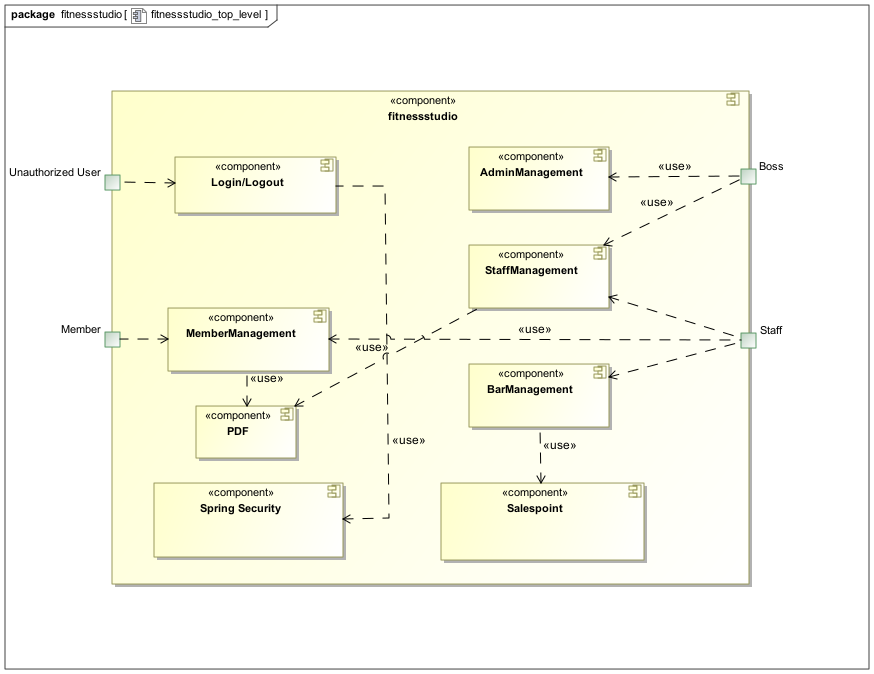

= Pflichtenheft
:project_name: Fitnessstudio
:company_name: Fitnessstudio e.V.
:toc: macro
:toc-title: Inhaltsverzeichnis

== __{project_name}__

[options="header"]
[cols="1, 1, 1, 1, 4"]
|===
|Version | Status      | Bearbeitungsdatum   | Autoren(en) |  Vermerk
|0.1     | In Arbeit   | 10.10.2019          | Autor       | Initiale Version
|===

toc::[]

== 1 Zusammenfassung
Dieses Dokument spiegelt das Pflichtenheft des Projekts {project_name} für die Firma {company_name} wider.
Es stellt einen Überblick über die zu erstellende Software und ihre Funktionen als Basis für die Kommunikation zwischen
den Interessengruppen, hauptsächlich der Kunde und das Entwicklungsteam. Dieses Dokument bildet die vertragliche Grundlage
zwischen Auftraggeber und -nehmer. Dafür muss es von beiden Seiten beständig aktualisiert und bestätigt werden.
Das Pflichtenheft sammelt alle Funktionen, die die Software bringen muss und deren angestrebte Umsetzung.

== 2 Aufgabenstellung und Zielsetzung
Es soll eine Software für den Einsatz in einem Fitnessstudio entwickelt werden. Dabei sollen verschiedene
Geschäftsfelder berücksichtigt werden. In der Mitarbeiterverwaltung können die Mitarbeiter des Fitnessstudios eingestellt,
bearbeitet und entlassen werden. Die Mitarbeiter haben verschiedene Aufgaben (Thekenkraft/Trainer) und Löhne.

Zum Monatsende wird für jeden Mitarbeiter ein Lohnschein als PDF erstellt. Die Mitarbeiter sollen einen eigenen Login bekommen,
um den Dienstplan zu betrachten und den Lohnschein abzurufen. Der Dienstplan muss ebenfalls von Mitarbeitern erstellt
und bearbeitet werden können.

Es sollen ebenfalls alle Mitglieder verwaltet werden können. Diese können in das Studio aufgenommen, bearbeitet und entlassen werden.
Um als Mitglied aufgenommen zu werden muss ein Vertrag abgeschlossen werden. Bei der Aufnahme soll ein Log-in erstellt werden,
mit dem der Kunde von zu Hause aus persönliche Daten, Vertrag und Probetraining verwalten kann.
Die monatlichen Gebühren werden per SEPA-Lastschrift vom Kunden abgebucht.

Jedes Mitglied erhält einen Code, mit dem es beliebig viele neue Mitglieder anwerben kann.
Wird dieser Code bei der Registrierung eines anderen Mitgliedes angegeben, so wird ein bestimmter Betrag
auf das Kundenkonto des Codeinhabers gutgeschrieben.
Jeder Kunde kann während seiner Mitgliedschaft mit einem Trainer ein Probetraining vereinbaren,
entweder direkt im Studio oder über das Internetportal des Studios. Eine Mitgliedschaft kann pro Jahr für einen Monat
ohne Gründe ausgesetzt und später nachgeholt werden.

Des Weiteren gibt es einen Eingangs- und Verkaufsbereich, dort meldet sich jedes Mitglied mit seiner Kunden-ID
bei Betreten des Studios an und bei Verlassen ab. An der Theke können auch Getränke, Nahrungsergänzungsmittel
oder Zubehör erworben werden, diese werden bar bezahlt oder direkt vom Kundenkonto abgebucht.
Mitglied können dann monatlich sich ihre Rechnung online als PDF ausgeben lassen.

Die Artikel des Verkaufsbereiches lassen sich ebenfalls verwalten. Es müssen Artikel hinzugefügt, bearbeitet
und gelöscht werden können. Unterschreiten Artikel die Mindestmenge, dann werden sie einer Bestellliste hinzugefügt
und für die Mitarbeiter sichtbar gemacht. Artikel, die für den Verzehr gedacht sind, haben ein Verfallsdatum,
welches bei jedem Programmstart überprüft wird. Für erschiedene Artikel soll man für einen bestimmten Zeitraum
einen Rabatt angeben können.

Online und nur für den Chef sind Statistiken über laufende Kosten, Einnahmen, Kundenverhalten und Verkaufsartikel grafisch dargestellt.
Sowie verschiedene Einstellungen wie Vertragslaufzeit, monatliche Gebühren, Einladungsprämie, Öffnungszeiten usw. verwaltbar.

== 3 Produktnutzung
Die Software soll auf einem Server laufen und dabei durchgängig über das Internet mit einem Browser
(z. B. Google Chrome, Firefox oder Safari) erreichbar sein. Hauptnutzungsgebiete sind dabei die Mitarbeiterverwaltung,
die Verkaufsstelle (Theke) und die Mitgliederverwaltung. Alle Felder sind über die gleiche Applikation mit verschiedenen
Log-ins erreichbar.

Alle sich anhäufende Daten sollen dabei dauerhaft in Form einer Datenbank gespeichert werden. Vertrauliche Daten,
wie z. B. Passwörter, sollen verschlüsselt gesichert werden. Für den Umgang mit der Datenbank wird kein technisches
Verständnis verausgesetzt, denn deren Verwaltung wird in der Website nutzerfreundlich dargestellt.

== 4 Interessensgruppen (Stakeholders)

[options="header", cols="2, ^1, 4, 4"]
|===
|Name
|Priorität (1..5)
|Beschreibung
|Ziel

|{company_name}
|5
|Der Kunde des Projekts.
a|
- Mehr Mitgliedschaften verkaufen
- Einfache Kosten-Verwaltung
- Nutzungsdaten speichern
- Inventar immer gefüllt
- Statistiken über das Kundenverhalten einsehen
- Verwaltung der Mitarbeiter

|Kunde
|4
|Der Kunde des Fitnessstudios
a|
- Planung des eigenen Trainingserfolgs
- Einfache Verwaltung der Mitgliedschaft
- Digitalisierung der Zahlung
- Einfachere Kommunikation mit dem Trainer

|Mitarbeiter
|3
|Mitarbeiter des Fitnessstudios
a|
- Einfache Verwaltung des Dienstplans
- Überblick über das Inventar

|Chef
|2
|Leiter des Fitnessstudios
a|
- Bearbeitung der Mitarbeiterdaten
- Globale Variablen leicht bearbeiten

|Entwickler
|3
|Sind für die Implementierung und spätere Wartung der Software verantwortlich.
a|
- Einfache Erweiterung mit Funktionen 
- Geringer Wartungsaufwand
- Gute debugging Mechanismen

|===

== 5 Systemgrenze und Top-Level-Architektur

=== 5.1 Kontextdiagramm
image:models/analysis/fitnessstudio_context.svg[fitnessstudio_context]

=== 5.2 Top-Level-Architektur

== 6 Anwendungsfälle

=== 6.1 Akteure

Akteure sind die Benutzer des Software-Systems oder Nachbarsysteme, welche darauf zugreifen. Die folgende Tabelle fasst alle Akteuer des Systems zusammen und enthält eine Beschreibung des Akteurs. Abstrakte Akteure (eine Obergruppe, welche andere Akteure gruppiert, in _Italic_ geschrieben) sind da um zu generalisieren und zu gruppieren.

// See http://asciidoctor.org/docs/user-manual/#tables
[options="header"]
[cols="1,4"]
|===
|Name |Beschreibung
|_User_ | Repräsentiert jeden Nutzer des Systems. Dabei ist es egal, ob der Nutzer überhaupt einen Nutzeraccount besitzt.
|Unregistered User | Repräsentiert jede Person, welche mit dem System interagiert, aber sich noch nicht eingeloggt hat. Darunter zählen auch alle Nutzer der Anwendung, welche noch keinen Nutzeraccount haben. 
|Staff | Jeder registrierte Nutzer mit der Rolle „STAFF“. Diese Rolle repräsentiert die Mitarbeiter des Fitnessstudios, welche die Anwendung zum verwalten des Dienstplans und Inventars nutzen. Außerdem sollen sie Nutzerkonten _aktivieren_ können.
|Boss | Jeder registierte Nutzer mit der Rolle „BOSS“. Er ist allmächtig und kann alles. Seine Hauptaufgabe ist das Verwalten der Mitarbeiter.
|Customer| Jeder registrierte Nutzer mit der Rolle „CUSTOMER“. Diese Role repräsentiert die Mitglieder des Fitnessstudios, welche die Anwendung nutzen um Details ihre Mitgliedschaft einzusehen und um ihr Training zu planen.
|===

=== 6.2 Überblick Anwendungsfalldiagramm
Anwendungsfall-Diagramm, das alle Anwendungsfälle und alle Akteure darstellt.

[[use_case_diagram]]
image::./models/use-case-diagramm.jpg[Use Case diagram, 100%, 100%, pdfwidth=100%, title= "Use case diagram des Projekts", align=center]

=== 6.3 Anwendungsfallbeschreibungen
Dieser Unterabschnitt beschreibt die Anwendungsfälle. In dieser Beschreibung müssen noch nicht alle Sonderfälle und Varianten berücksichtigt werden. Schwerpunkt ist es, die wichtigsten Anwendungsfälle des Systems zu finden. Wichtig sind solche Anwendungsfälle, die für den Auftraggeber, den Nutzer den größten Nutzen bringen.
Für komplexere Anwendungsfälle ein UML-Sequenzdiagramm ergänzen.
Einfache Anwendungsfälle mit einem Absatz beschreiben.
Die typischen Anwendungsfälle (Anlegen, Ändern, Löschen) können zu einem einzigen zusammengefasst werden.

[cols="1h, 3"]
[[UC101]]
|===
|ID |**<<UC101>>**
|Name |Edit Global Variables
|Beschreibung                |Der Boss soll die allgemeinen Details (Öffnungszeiten etc.) des Fitnessstudios ändern können. (Chef ist in diesem Fall der wirklich Chef und Boss die Rolle im System)
|Akteur                     |Boss
|Auslöser                    |
Boss möchte die allgemeinen Details ändern und drückt auf bearbeiten neben den Details.
|Vorbedingungen a|
Der Chef des Fitnessstudios muss sich als Boss im System anmelden.
|Wichtige Schritte           a|

  1. Als Boss anmelden
  2. Boss drückt den „Bearbeiten“ Button neben den Details.
  3. Der Boss ändert die Details.
4. Der Boss drückt auf Speichern
5. Die Details wurden gespeichert und jetzt für jeden angezeigt.

|Anhang                 |-
|Funktionelle Anforderung    |**<<F0100>>**, **<<F0210>>**
|===

[[UC110]]  [[UC111]]
|===
|ID |**<<UC101>> & <<UC111>>**
|Name |Edit/Add/Remove Staff
|Beschreibung                |Der Boss soll neue Mitarbeiter hinzufügen, bestehende Mitarbeiter bearbeiten und alte Mitarbeiter entfernen können.
|Akteur                     |Boss
|Auslöser                    |
Boss möchte etwas an den Mitarbeitern „ändern“ und navigiert zur Mitarbeiterliste.
|Vorbedingungen a|
Der Boss des Fitnessstudios muss sich im System anmelden.
|Wichtige Schritte           a|

  1. Boss meldet sich an
  2.Boss navigiert zu den "Mitarbeiterliste".
 3.Boss drückt den „Bearbeiten“, „Hinzufügen“, „Löschen“ Button
  4. Der Boss ändert/fügt die Details hinzu.
5. Der Boss drückt auf Speichern
6. Die Änderungen an den Staffs wurden gespeichert.

|Anhang                 |-
|Funktionelle Anforderung    |**<<F0410>>**, **<<F0420>>**, **<<F0210>>**
|===

[cols="1h, 3"]
[[UC120]]
|===
|ID |**<<UC120>>**
|Name |Show Statistics
|Beschreibung                |Der Boss soll sich die Statistiken über Kaufverhalten, Anwesenheitszeit und Umsatz ansehen können.
|Akteur  |Boss
|Auslöser                    |
Boss möchte sich Statistiken ansehen und navigiert zu Statistiken.
|Vorbedingungen a|
Der Boss des Fitnessstudios muss sich anmelden. Die Statistiken müssen ausgewertet und angelegt worden sein.
|Wichtige Schritte           a|

  1. Boss meldet sich als Boss an
2. Boss navigiert zu den Statistiken.
|Anhang                 |-
|Funktionelle Anforderung    |**<<F1000>>**, **<<F0210>>**
|===

[cols="1h, 3"]
[[UC201]]
|===
|ID |**<<UC201>>**
|Name |Manage Inventory Items
|Beschreibung                |Die Staffs sollen die Artikel des Inventar des Fitnessstudios verwalten können.
|Akteur                     |Staff
|Auslöser                    |
Staff möchte das Inventar verwalten/bearbeiten und navigiert zum Inventar.
|Vorbedingungen a|
Der Staff muss im System angemeldet sein. Es muss ein Inventar geben. 
|Wichtige Schritte           a|

  1. Staff meldet sich an.
  2.Staff navigiert zum Inventar.
3. Staff führt die verwaltende Aufgabe aus.
4. Änderungen sollen gespeichert werden.
|Anhang                 |-
|Funktionelle Anforderung    |**<<F0620>>**, **<<F0210>>**
|===

[cols="1h, 3"]
[[UC202]]
|===
|ID |**<<UC202>>**
|Name |Sell Items
|Beschreibung                |Customer sollen etwas kaufen können.
|Akteur                     |Staff & Customer
|Auslöser                    |
Customer kauft etwas an der Theke und der Staff trägt es ein.
|Vorbedingungen a|
Der Staff muss im System angemeldet sein. Es muss ein Inventar geben. 
|Wichtige Schritte           a|

  1. Staff meldet sich an.
2. Staff trägt den Verkauf ein (Wer, Was).
3. Fügt etwas zu den Statistiken hinzu.
4. Das Konto des Customers wird belastet, wenn er nicht bar bezahlt.
5. Der Kauf wird in der Rechnung des Customers gespeichert.
6. Im Inventar wird die Anzahl des gekauften Artikels um 1 verringert.
7. Die Statistiken werden aktualisiert.

|Anhang                 |-
|Funktionelle Anforderung    |**<<F0630>>**, **<<F0210>>**, **<<F0600>>**
|===

[cols="1h, 3"]
[[UC203]]
|===
|ID |**<<UC203>>**
|Name |Show Inventory
|Beschreibung                |Staff wird Inventar gezeigt
|Akteur                     |Staff 
|Auslöser                    |
Staff möchte Inventar ansehen und navigiert zum Inventar.
|Vorbedingungen a|
Es muss ein Inventar geben. Der Staff muss angemeldet sein.
|Wichtige Schritte           a|

  1. Staff meldet sich an.
  2. Staff navigiert zum Inventar.
3. Liste wird angezeigt.
|Anhang                 |-
|Funktionelle Anforderung    |**<<F0610>>**, **<<F0210>>**
|===

[cols="1h, 3"]
[[UC210]]
|===
|ID |**<<UC210>>**
|Name | Manage Discounts
|Beschreibung                | Ein Staff möchte einen Rabatt einstellen.
|Akteur                     |Staff
|Auslöser               | Es wurde eine Anfrage für ein Probetraining gesendet. Ein Staff drückt auf „Anfragen bearbeiten“.
|Vorbedingungen a| Staff muss angemeldet sein. Es muss ein Objekt existieren auf die ein Rabatt angewendet werden kann.
|Wichtige Schritte           a| 1. Der Staff muss angemeldet sein.
2. Der Staff navigiert zum Inventar.
3. Der Staff drückt auf Rabatt neben dem entsprechenden Artikel.
4. Der Staff gibt den Rabatt ein.
5. Der Staff speichert.

|Anhang                 |-
|Funktionelle Anforderung    |**<<F0640>>**
|===

[cols="1h, 3"]
[[UC301]]
|===
|ID |**<<UC301>>**
|Name |Login/Logout
|Beschreibung                |Ein User sollte sich anmelden können, um bestimmte Features nutzen zu können.
Diesen Prozess kann man mit Abmelden rückgängig machen.
|Akteur                     |User
|Auslöser                    |
_Login_: User möchte „versteckte“ Features nutzen.

_Logout_: User möchte das System wieder verlassen.
|Vorbedingungen a|
_Login_: User ist noch nicht angemeldet. (Unregistered User)

_Logout_: User ist angemeldet.
|Wichtige Schritte           a|
_Login_:

  1. User drückt „Anmelden/Login“
  2. User gibt seine Zugangsdaten ein
  3. User drückt den „Login“ Button

_Logout_:

  1. User drückt "Ausloggen" 
  2. User ist abgemeldet und ihm wird der Home Bildschirm gezeigt.

|Anhang                 |-
|Funktionelle Anforderung    |**<<F0210>>**
|===

[cols="1h, 3"]
[[UC302]]
|===
|ID |**<<UC302>>**
|Name |Sell Items
|Beschreibung                |Eine Person soll ein Kundenkonto erstellen können.
|Akteur                     |Unregistered User
|Auslöser                    |
Neues Kundenkonto soll erstellt werden und der Unregistered User drückt auf registrieren.
|Vorbedingungen a|
Es darf noch nicht ein Kundenkonto mit den Angaben geben. 
|Wichtige Schritte           a|

  1. Unregistered User drückt auf „Registrieren“.
  2. Unregistered User gibt die notwendigen Anmeldedaten ein.
3. Neues Kundenkonto wird erstellt.
4. Nach Freigabe durch Staff kann unregistered User sich mit dem Konto anmelden.
5. Unregistered User gelangt zurück zum Homebildschirm.
|Anhang                 |-
|Funktionelle Anforderung    |**<<F0221>>**, **<<F0222>>**, **<<F0210>>**
|===

[cols="1h, 3"]
[[UC320]]
|===
|ID |**<<UC320>>**
|Name |CheckIn & CheckOut
|Beschreibung                | Der Customer soll beim Betreten des Fitnessstudios im System als Anwesend markiert werden. Mit dem Prozess CheckOut kann man den Vorgang umkehren.
|Akteur                     |Customer
|Auslöser                    |_CheckIn_: Customer betritt das Fitnessstudio und meldet sich mit seiner Chipkarte an. (Staff trägt ihn als Aktiv ein)
_CheckOut_: Customer verlässt das Fitnessstudio. (Staff trägt ihn als inaktiv ein)
|Vorbedingungen a| _CheckIn_: Nutzer ist noch nicht im Fitnessstudio.
_CheckOut_: Nutzer ist im Fitnessstudio.
|Wichtige Schritte           a|

_CheckIn_:
1.	Customer betritt das Fitnessstudio.
2. Ein angemeldeter Staff setzt den Status des Customers auf aktiv.
3.	Im System ist der Customer jetzt anwesend.
_CheckOut:_:
1.	Customer verlässt das Studio.
2. Ein angemeldeter Staff setzt den Status des Customers auf inaktiv.
3.	Customer ist im System als abwesend markiert.
|Anhang                 |-
|Funktionelle Anforderung    |**<<F1010>>**
|===

[cols="1h, 3"]
[[UC401]]
|===
|ID |**<<UC401>>**
|Name |Show Recruiting Code
|Beschreibung                | Customer soll seinen Anwerberkode sehen.
|Akteur                     |Customer
|Auslöser               | Customer möchte seinen Kode sein und geht auf sein Profil.
|Vorbedingungen a| Der Kode muss vergeben worden sein.
|Wichtige Schritte           a| 1. Customer meldet sich an.
2. Customer geht auf sein Profil.
3. Customer sieht seinen Anwerberkode.
|Anhang                 |-
|Funktionelle Anforderung    |**<<F0730>>**, **<<F0210>>**
|===
[cols="1h, 3"]
[[UC410]]
|===
|ID |**<<UC410>>**
|Name |Show Contract Details
|Beschreibung                | Customer sieht seine Vertragsdetails.
|Akteur                     |Customer
|Auslöser               | Customer möchte seine Vertragsdetails sehen und drückt auf Profil.
|Vorbedingungen a| Customer muss einen Vertrag bei der Anmeldung abgeschlossen werden.
|Wichtige Schritte           a| 1. Customer meldet sich an.
2. Customer geht auf sein Profil.
3. Customer sieht seinen Vertragsdetails.
|Anhang                 |-
|Funktionelle Anforderung    |**<<F0710>>**, **<<F0210>>**
|===

[cols="1h, 3"]
[[UC411]]
|===
|ID |**<<UC411>>**
|Name |Pause Contract for one Month
|Beschreibung                | Customer soll seinen Vertrag für einen Monat pausieren.
|Akteur                     |Customer
|Auslöser               | Customer möchte seinen Vertrag für einen Monat pausieren und drückt im Profil auf Vertrag pausieren.
|Vorbedingungen a| Customer muss einen Vertrag bei der Anmeldung abgeschlossen werden.
|Wichtige Schritte           a| 1. Customer meldet sich an.
2. Customer geht auf sein Profil.
3. Customer drückt auf „Vertrag pausieren“.
4. Customer bestätigt.
5. Vertrag wird für einen Monat pausiert.
6. Erst im nächsten Jahr soll es wieder möglich sein seinen Vertrag zu pausieren.

|Anhang                 |-
|Funktionelle Anforderung    |**<<F0720>>**, **<<F0210>>**
|===

[cols="1h, 3"]
[[UC420]]
|===
|ID |**<<UC420>>**
|Name |Show Bill
|Beschreibung  | Der Customer soll seine monatliche Rechnung ansehen können.
|Akteur                     |Customer
|Auslöser               | Customer möchte seine Rechnung sehen und klickt in seinem Profil auf „Rechnung“.
|Vorbedingungen a| Der Customer muss angemeldet sein und es muss eine Rechnung erstellt werden.
|Wichtige Schritte           a| 1. Customer meldet sich an.
2. Customer geht auf sein Profil.
3. Customer klickt auf „Rechnung“.
4. Dem Customer wird die Rechnung angezeigt. (Als PDF)
|Anhang                 |-
|Funktionelle Anforderung    |**<<F0710>>**, **<<F0210>>**
|===

[cols="1h, 3"]
[[UC501]]
|===
|ID |**<<UC501>>**
|Name |Create Training
|Beschreibung                | Ein Staff erstellt ein Trainingsplan.
|Akteur                     |Staff
|Auslöser               | Staff möchte Trainingsplan erstellen und navigiert zu Trainingsplan.
|Vorbedingungen a| Staff muss angemeldet sein.
|Wichtige Schritte           a| 1. Staff meldet sich an.
2. Staff navigiert zu Trainingsplan erstellen.
3. Gibt Daten ein.
4. Speichern
5. Customer wird Trainingsplan zugewiesen.
|Anhang                 |-
|Funktionelle Anforderung    |**<<F0820>>**, **<<F0210>>**
|===

[cols="1h, 3"]
[[UC502]]
|===
|ID |**<<UC502>>**
|Name |Show Trainings
|Beschreibung  | Der Customer soll seine Trainingstermine sehen. 
|Akteur                     |Customer
|Auslöser               | Customer möchte seine Termine sehen und klickt auf „Trainingsplan“
|Vorbedingungen a| Der Customer muss angemeldet sein und es muss ein Trainingsplan existieren.
|Wichtige Schritte           a| 1. Customer meldet sich an.
2. Der Customer navigiert zu Trainingsplan
3. Dem Nutzer wird eine Liste seiner Termine angezeigt.
|Anhang                 |-
|Funktionelle Anforderung    |**<<F0810>>**, **<<F0210>>**
|===

[cols="1h, 3"]
[[UC510]]
|===
|ID |**<<UC510>>**
|Name |Request Tryout
|Beschreibung                | Ein Customer fragt ein Probetraining an.
|Akteur                     |Customer
|Auslöser               | Ein Customer möchte seine Probetraining einlösen und klickt auf die Schaltfläche „Probetraining anfordern“.
|Vorbedingungen a| Der User muss sich als Customer anmelden. Er darf sein Probetraining noch nicht genutzt haben.
|Wichtige Schritte           a| 1. Customer meldet sich an.
2. Customer klickt auf die Schaltfläche.
3. Es wird überprüft ob er ein Probetraining bereits gemacht hat. 
4. Wenn nicht kann er einen Antrag ausfüllen. Dabei kann er einen beliebigen Trainer und Termin angeben.
5. Durch „Absenden“ wird die Anfrage gesendet. 
|Anhang                 |-
|Funktionelle Anforderung    |**<<F0831>>**, **<<F0210>>**
|===

[cols="1h, 3"]
[[UC520]]
|===
|ID |**<<UC520>>**
|Name | Accept/Decline Request
|Beschreibung                | Die Anfrage eines Customers für ein Probetraining soll bearbeitet werden.
|Akteur                     |Staff
|Auslöser               | Es wurde eine Anfrage für ein Probetraining gesendet. Ein Staff drückt auf „Anfragen bearbeiten“.
|Vorbedingungen a| Der User muss als Staff angemeldet sein. 
|Wichtige Schritte           a| 1. Staff meldet sich an.
2. Staff navigiert zu Anfragen bearbeiten
3. Wenn Anfragen vorhanden sind, werden diese angezeigt.
4. Durch drücken auf „Annehmen“ kann man die Anfrage annehmen, durch „Ablehnen“ kann man die Anfrage ablehnen.
5. Wenn die Anfrage angenommen wurde wird dem Nutzer der Termin bestätigt. Er kann absofort kein Probetraining mehr anfragen. Wenn nicht erhält der Nutzer die Möglichkeit einen anderen Termin zu wählen. In diesem Fall hat er also immer noch sein freies Probetraining.

|Anhang                 |-
|Funktionelle Anforderung    |**<<F0832>>**, **<<F0210>>**
|===

[cols="1h, 3"]
[[UC601]] [[UC602]]
|===
|ID |**<<UC601>> & <<UC601>>**
|Name |Show Roster & Edit Roster
|Beschreibung  | Ein Staff soll den Dienstplan sehen und bearbeiten könne. 
|Akteur                     |Staff
|Auslöser               | Staff möchte den Dienstplan bearbeiten und drückt auf „Dienstplan“.
|Vorbedingungen a| Der Staff muss angemeldet sein.
|Wichtige Schritte           a| 1. Der Staff muss sich anmelden.
2. Der Staff navigiert zu Dienstplan.
3. Der Staff sieht den Dienstplan.
4. Durch drücken von „Bearbeiten“ kann er bestimmte Termine bearbeiten und erstellen. Dabei muss er angeben welcher Kollege wann welchen Dienst macht.
5. Durch Speichern wird der Eintrag gespeichert.
|Anhang                 |-
|Funktionelle Anforderung    |**<<F0910>>**, **<<F0920>>**, **<<F0210>>**
|===

[cols="1h, 3"]
[[UC701]] [[UC702]]
|===
|ID |**<<UC701>> & <<UC702>>**
|Name |Remove & Edit Customer
|Beschreibung                | Ein Staff bearbeitet die Liste der Customer.
|Akteur                     |Staff
|Auslöser               | Ein Staff möchte Customer bearbeiten und drückt auf „Mitglieder bearbeiten“.
|Vorbedingungen a| Der Staff muss angemeldet sein. 
|Wichtige Schritte           a| 1. Staff muss sich anmelden.
2. Staff navigiert zu „Mitglieder bearbeiten“.
3. Staff bearbeitet die Liste der Customer. (Entfernen, Details bearbeiten)
|Anhang                 |-
|Funktionelle Anforderung    |**<<F0310>>**, **<<F0210>>**
|===

[cols="1h, 3"]
[[UC720]]
|===
|ID |**<<UC720>>**
|Name | Add Credits
|Beschreibung                | Ein Staff hat an der Theke von einem Customer Geld erhalten und soll dieses nun auf sein Guthabenkonto laden.
|Akteur                     |Staff
|Auslöser               | Ein Staff möchte für einen Customer Geld aufladen und drückt auf Guthaben hinzufügen.
|Vorbedingungen a| Staff muss angemeldet sein. 
|Wichtige Schritte           a| 1. Staff muss sich anmelden.
2. Staff navigiert zu „Guthaben hinzufügen“.
3. Staff wählt Customer aus und gibt Betrag ein.
4. Der Betrag wird auf das Guthabenkonto des Customers überwiesen. 
5. Eine Bemerkung soll auf der Rechnung des Customers erscheinen.

|Anhang                 |-
|Funktionelle Anforderung    |**<<F0510>>**, **<<F0210>>**
|===

[cols="1h, 3"]
[[UC730]]
|===
|ID |**<<UC730>>**
|Name |Activate Account
|Beschreibung                | Ein neues Nutzerkonto muss von einem Staff freigegeben werden.
|Akteur                     |Staff
|Auslöser               | Ein neues Nutzerkonto wurde erstellt und muss jetzt noch freigegeben werden. Der Staff drückt dafür in der Liste der Mitglieder auf akzeptieren.
|Vorbedingungen a| Es muss ein noch nicht freigegeben Konto geben.
|Wichtige Schritte           a| 1. Staff meldet sich an.
2. Staff navigiert zu „Nutzeraccounts freigeben“.
3. Alle nicht freigegeben Nutzeraccounts werden angezeigt.
4. Durch drücken auf akzeptieren wird der Account freigegeben.
5. Das Staff kann sich jetzt anmelden.
|Anhang                 |-
|Funktionelle Anforderung    |**<<F0222>>**, **<<F0210>>**
|===

== 7 Funktionale Anforderungen
In diesem Abschnitt wird beschrieben, was das zu erstellende Programm leisten soll.
Dabei wird sich vor allem auf die eigentliche Implementierung bezogen. Im Vergleich zur Anwendungsfallbeschreibung wird hier demnach eher die technische Sicht verdeutlicht.

=== 7.1 Muss-Kriterien
Anfordeungen die das Programm auf alle Fälle erfüllen muss.

[options="header", cols="2h, 1, 3, 12"]
|===
|ID
|Version
|Name
|Beschreibung

|**<<F0100>>**
|v0.1
|Allgemeine Informationen ändern
a| [[F0100]]
Das System soll diese Informationen über das Fitnessstudio global speichern und für den Boss anpassbar machen:

* Name
* Adresse
* Öffnungszeiten
* Einladungsprämie

|**<<F0210>>**
|v0.1
|Authentifizierung
a| [[F0210]]
Das System muss zwischen öffentlich zugänglichen und geschützten Informationen und Funktionen unterscheiden. Registrierten Nutzern ist es möglich sich über die Angabe folgender Informationen zu authentifizieren:

* Identifikationsnummer
* Passwort

Der Nutzer muss durch den Login in eine der Gruppen Kunde, Mitarbeiter oder Boss eingeordnet werden, welche verschiedene Rechte haben. Durch ein Logout erlischen diese wieder.

|**<<F0221>>**
|v0.1
|Registrierung
a| [[F0221]]
Es muss möglich sein unregistrierte Nutzer über die Auswahl "registrieren" in das System aufzunehmen. Diese Informationen müssen dafür angegeben werden:

* E-Mai Adresse (noch keinem Nutzerkonto zugeordnet)
* voller Name
* Passwort
* Einladungscode (optional)

Das System muss alle so registrierten Nutzer persistent speichern. Erst nach der Freigabe des Accounts **<<F0222>>**) durch einen Mitarbeiter muss der Kunde in die Mitgliederliste aufgenommen werden. Er erhält eine eindeutige Identifikationsnummer und kann sich nun mit dieser und seinem Passwort anmelden (**<<F0210>>**).

|**<<F0222>>**
|v0.1
|Aktivierung eines Accounts
a| [[F0222]]
Wählt ein Mitarbieter die Funktion "aktivieren" für einen registrierten (**<<F0221>>**) Neukunden aus, wird diesem eine eindeutige Nummer zugeordnet mit der er in das System eingetragen wird. Erst damit ist es dem Nutzer möglich sich als Kunde anzumelden (**<<F0210>>**).

|**<<F0300>>** & **<<F0400>>**
|v0.1
|Kunden und Mitarbeiter
a| [[F0300]] [[F0400]]
Das System muss:

* Identifikationsnummer
* E-Mail Adresse 
* vollen Namen
* Passwort 

der Kunden und Mitarbeiter dauerhaft speichern.

|**<<F0310>>**
|v0.1
|Kunden bearbeiten und löschen
a| [[F0310]]
Das System muss es authentifizierten Mitarbeitern möglich machen einzelne Details eines Kunden zu bearbeiten oder seinen Account zu löschen.

|**<<F0410>>**
|v0.1
|Mitarbeiter bearbeiten und löschen
a| [[F0410]]
Das Systen muss es dem Boss möglich machen einzelne Details eines Mitarbeiters zu bearbeiten oder seinen Account zu löschen.

|**<<F0420>>**
|v0.1
|Mitarbeiter hinzufügen
a| [[F0420]]
Das System muss den Boss Mitarbeiter hinzufügen lassen. Dafür müssen:

* voller Name
* E-Mail Adresse
* Passwort 

angegeben werden. Eine Identifikationsnummer muss vom System generiert werden.

|**<<F0500>>**
|v0.1
|Guthabenkonto
a| [[F0500]]
Das System muss für jeden Kunden einen Betrag als Guthaben seines Kontos persistent speichern.

|**<<F0510>>**
|v0.1
|Guthaben erhöhen
a| [[F0510]]
Das System muss authentifizierte Mitarbeiter den Betrag des Guthabenkontos eines beliebeigen Kunden um einen manuell eingegebenen Betrag erhöhen lassen.

|**<<F0600>>**
|v0.1
|Inventar
a| [[F0600]]
Das System muss Daten über das Verkaufsinventar dauerhaft speichern. Dazu gehören:

* Name
* Preis
* Anzahl
* Mindestanzahl
* aktueller Rabatt (optional)

|**<<F0610>>**
|v1.0
|Inventar anzeigen
a| [[F0610]]
Das System muss es den authentifizierten Mitarbeitern möglich machen Name und Anzahl der Artikel im Inventar einzusehen. Das unterschreiten der Mindestmenge muss hierbei farblich angezeigt werden.

|**<<F0620>>**
|v1.0
|Inventar bearbeiten
a| [[F0620]]
Das System muss es authentifizierten Mitarbietern ermöglichen Artikel aus dem Inventar zu entfernen oder neue hinzuzufügen.

|**<<F0630>>**
|v1.0
|Artikel verkaufen
a| [[F0630]]
Das System muss den authentifizierten Mitarbieter Artikel aus dem Inventar verkaufen lassen. Nachdem die Artikel ausgewählt wurden muss eine registrierte Kundennummer verlangt werden und die Optionen "bar" oder mit "Guthaben" zahlen müssen angebbar sein. Das Inventar wird vom System aktualisiert. Der Kauf wird in die Statistiken (**<<F1000>>**) und die monatliche Rechnung des Kunden (**<<F0710>>**) übernommen.

|**<<F0640>>**
|v1.0
|Rabatte verwalten
a| [[F0640]]
Das System muss es authentifizierten Mitarbeitern erlauben zu einzelnen Artikeln des Inventars Rabatte hinzuzufügen, zu ändern oder zu entfernen. Dazu wird manuell ein Prozentsatz eingegeben, welcher vom System als aktueller Rabatt gespeichert wird.

|**<<F0710>>**
|v1.0
|Vertragsdetails anzeigen
a| [[F0710]]
Das System muss einem authentifizierten Kunden Informationen über seinen Vertrag mit dem Fitnessstudio anzeigen. Damit sind gemeint:

* monatlicher Beitrag
* Vertragslaufzeit
* Rechnung des letzten Monats (als PDF)

|**<<F0720>>**
|v1.0
|Vertrag pausieren
a| [[F0720]]
Das System muss es jedem Kunden einmal pro Jahr ermöglichen die Auswahl "Vertrag pausieren" zu treffen. Für den nächsten Monat werden keine Beitragskosten berechnet und die Vertragslaufzeit wird um einen Monat verlängert.

|**<<F0730>>**
|v1.0
|Anwerbe Code anzeigen
a| [[F0730]]
Das System muss jedem aktivierten (**<<F0222>>**) Kundenkonto einen eindeutigen Code zur Verfügung stellen. Wird ein Neukonto mit diesem Code freigegeben, erhöht das System das Guthaben des Altkunden um einen festgelegten Wert. Der Code kann dabei beliebig oft angezeigt und von neuen Kunden während der Registrierung (**<<F0221>>**) angegeben werden.

|**<<F0800>>**
|v1.0
|Trainingstermin
a| [[F0800]]
Das System muss für jeden Kunden einen Trainigstermin dauerhaft speichern können. Dazu gehören:

* Kunde (eindeutig durch Nummer)
* Mitarbeiter (eindeutig durch Nummer)
* Datum
* Anfangs- und Endzeiten

|**<<F0810>>**
|v1.0
|Trainingstermin anzeigen
a| [[F0810]]
Das System muss den nächsten vereinbarten Trainingstermin für einen authentifizierten Kunden sichtbar machen.

|**<<F0820>>**
|v1.0
|Trainingstermin erstellen
a| [[F0820]]
Das System muss es authentifizierten Mitarbeitern ermöglichen einen neuen Trainingstermin für einen beliebigen Kunden zu speichern. Das System aktualisiert ggf. die Anzeige (**<<F0810>>**) des Kunden.

|**<<F0831>>**
|v1.0
|Probetraining anfragen
a| [[F0831]]
Das System muss jedem authentifizierten Kunden die Möglichkeit bieten über "Probetraining anfordern" eine Anfrage mit den Merkmalen aus **<<F0800>>** zu senden. Wurde diese Anfrage einmal angenommen (**<<F0832>>**) wird der Kunde vom System vermerkt und kann keine Anfragen mehr senden.

|**<<F0832>>**
|v1.0
|Probetraining annehmen/ablehnen
a| [[F0832]]
Das System muss jedem authentifizierten Mitarbeiter unter "Anfragen bearbeiten" eine Liste der aktuellen, unbeantworteten Anfragen anzeigen. Wird eine der beiden Optionen "annehmen" oder "ablehnen" gewählt, wird diese dem Kunden angezeigt und der bearbeitete Eintag muss aus der Liste entfernt werden. In dem Fall einer angenommenen Anfrage erstellt das System einen Trainingtermin (**<<F0800>>**) für den angegebenen Kunden.

|**<<F0900>>**
|v1.0
|Dienstplan
a| [[F0900]]
Das System soll in der Lage sein den aktuellen Dienstplan zu speichern. Ein Dienst besteht dabei aus:

* Mitarbeiter (eindeutig durch Nummer)
* Art der Tätigkeit
* Datum
* Anfangs- und Endzeiten

|**<<F0910>>**
|v1.0
|Dienstplan anzeigen
a| [[F0910]]
Das System muss es jedem authentifizierten Mitarbeiter ermöglichen den aktuellen Dienstplan einzusehen. Dieser wird tabellarisch als Kalender angezeigt.

|**<<F0920>>**
|v1.0
|Dienstplan bearbeiten
a| [[F0920]]
Das System muss einzelne Dienste, der in **<<F0900>>** beschriebenen Form, von jedem authentifizierten Mitarbieter bearbeiten, löschen oder hinzugügen lassen können.

|**<<F1000>>**
|v1.0
|Statistiken anzeigen
a| [[F1000]]
Das System muss dem Boss eine graphische Übersicht über Kundenverhalten (Anwesenheitszeiten, Käufe) und Umsatz (Löhne, Beiträge, Verkäufe) geben.

|**<<F1010>>**
|v0.1
|Check-In/-Out
a| [[F1010]]
Das System muss die Aufenthaltszeiten der Kunden im Fittnessstudio dauerhaft speichern. Dazu muss es dem authentifizierten Mitarbeiter möglich sein über "CheckIn" oder "CheckOut" und die Identifikationsnummer die Ein- und Austrittszeiten eines beliebigen Kunden zu erfassen zu lassen.

|===

=== 7.2 Kann-Kriterien
Anforderungen die das Programm leisten können soll, aber für den korrekten Betrieb entbehrlich sind.

[options="header", cols="2h, 1, 3, 12"]
|===
|ID
|Version
|Name
|Beschreibung

|**<<F0231>>**
|v1.0
|Neues Passwort senden
a| [[F0231]]
Das System kann die Auswahl "Passwort vergessen" bereitstellen. Wird diese getroffen, versendet das System eine E-Mail mit einem neuen, generierten Passwort an die gespeicherte Adresse. Dieses wurde in den Speicher des Systems übernommen und ermöglicht eine erneute Anmeldung.

|**<<F0232>>**
|v1.0
|Passwort ändern
a| [[F0232]]
Das System kann authentifizierten Nutzern eine Änderung des Passworts ermöglichen. Dazu muss das alte und ein neues Passwort eingegeben werden. Das geänderte Passwort wird in den Systemspeicher übernommen.

|**<<F0320>>**
|v1.0
|Adresse speichern
a| [[F0320]]
Das System kann neben den in **<<F0300>>** angegebenen Daten auch eine Adresse des Kunden oder Mitarbeiters dauerhaft speichern.

|**<<F0520>>**
|v1.0
|Guthaben anzeigen
a| [[F0520]]
Das System kann authentifizierten Kunden das aktuelle Guthaben anzeigen.

|**<<F0650>>**
|v1.0
|Nachbestellliste
a| [[F0650]]
Das System kann den authentifizierten Mitarbeitern durch anwählen der "Nachbestellliste" eine PDF anzeigen. Diese enthält alle Artikel des Inventars, die die gespeicherte Mindestmenge unterschritten haben.

|**<<F0740>>**
|v1.0
|Bezahlmethoden
a| [[F0740]]
Das System kann dem authentifizierten Kunden mehrere Optionen (Paypal und Kreditkarte) zum bezahlen der monatlichen Rechnung bieten.

|**<<F0833>>**
|v1.0
|Bestätigungsemail
a| [[F0833]]
Das System kann eine automatisch generierte E-Mail an einen Kunden senden, sobald ein von ihm angefragter Trainingstermin angenommen oder abgelehnt wurde (**<<F0832>>**).

|**<<F0840>>**
|v1.0
|Trainingsplan anzeigen
a| [[F0840]]
Das System kann einem authentifizierten Kunden alle anstehenden Trainigstermine in Form eines kalendarischen Trainingsplans anzeigen.

|===

== 8 Nicht-Funktionale Anforderungen

=== 8.1 Qualitätsziele
Die folgende Tabelle zeigt, welche Qualitätsanforderungen in welchem Umfang erfüllt werden müssen.
Die erste Spalte listet die Qualitätsanforderungen auf, während in den folgenden Spalten ein "x" verwendet wird, um die Priorität zu kennzeichnen.
Die zugewiesene Priorität muss bei der Formulierung der konkreten nichtfunktionalen Anforderungen berücksichtigt werden.

1 = Nicht wichtig ..
5 = Sehr wichtig
[options="header", cols="3h, ^1, ^1, ^1, ^1, ^1"]
|===
|Qualitätsanforderungen| 1 | 2 | 3 | 4 | 5
|Wartbarkeit           |   |   |   | x |
|Benutzbarkeit         |   |   | x |   |
|Effizienz             |   |   |   | x |
|Funktionalität        |   |   |   |   | x
|Übertragbarkeit       | x |   |   |   | 
|Zuverlässigkeit       |   |   | x |   |
|Sicherheit            |   |   | x |   |
|Nutzerfreundlichkeit  |   | x |   |   |
|Erreichbarkeit        |   | x |   |   |
|===

=== 8.2 Konkrete Nicht-Funktionale Anforderungen

[options="header"]
|===
|Ziel |Beschreibung |
|Betriebszeit|Das System soll nur zu kurzen Wartungszeiten offline genommen werden. Sonst soll das System immer erreichbar sein. |
|Sicherheit| Die Daten der Nutzer sollen sicher verschlüsselt gespeichert werden.|
|Effizienz|Der Code soll effizient sein. Redundanzen sollen vermieden werden, dass eine hohe Geschwindigkeit möglich ist.|
|Funktionalität|Das System soll niemals abstürzen und alle Funktionen soll richtig funktionieren.|

== 9 GUI Prototyp

In diesem Kapitel soll ein Entwurf der Navigationsmöglichkeiten und Dialoge des Systems erstellt werden.
Idealerweise entsteht auch ein grafischer Prototyp, welcher dem Kunden zeigt, wie sein System visuell umgesetzt werden soll.
Konkrete Absprachen - beispielsweise ob der grafische Prototyp oder die Dialoglandkarte höhere Priorität hat - sind mit dem Kunden zu treffen.

=== 9.1 Überblick: Dialoglandkarte
Erstellen Sie ein Übersichtsdiagramm, das das Zusammenspiel Ihrer Masken zur Laufzeit darstellt. Also mit welchen Aktionen zwischen den Masken navigiert wird.
//Die nachfolgende Abbildung zeigt eine an die Pinnwand gezeichnete Dialoglandkarte. Ihre Karte sollte zusätzlich die Buttons/Funktionen darstellen, mit deren Hilfe Sie zwischen den Masken navigieren.

=== 9.2 Dialogbeschreibung
Für jeden Dialog:

1. Kurze textuelle Dialogbeschreibung eingefügt: Was soll der jeweilige Dialog? Was kann man damit tun? Überblick?
2. Maskenentwürfe (Screenshot, Mockup)
3. Maskenelemente (Ein/Ausgabefelder, Aktionen wie Buttons, Listen, …)
4. Evtl. Maskendetails, spezielle Widgets

== 10 Datenmodell

=== 10.1 Überblick: Klassendiagramm
UML-Analyseklassendiagramm
[[class_diagram]]

=== 10.2 Klassen und Enumerationen
Dieser Abschnitt stellt eine Vereinigung von Glossar und der Beschreibung von Klassen/Enumerationen dar. Jede Klasse und Enumeration wird in Form eines Glossars textuell beschrieben. Zusätzlich werden eventuellen Konsistenz- und Formatierungsregeln aufgeführt.

// See http://asciidoctor.org/docs/user-manual/#tables
[options="header"]
|===
|Klasse/Enumeration |Beschreibung |
|Person                  |Allgemeine Darstellung einer realen Person, die eine Darstellung im System hat. Diese Darstellung wird nur erstellt, wenn sich ein Benutzer beim System anmeldet, und nur verwendet, wenn er sich authentifiziert.            |
|Staff                  |stellt eine Thekenkraft dar, die Artikel, wie Getränke oder Trainingsgeräte verkaufen kann und Mitglieder verwalten kann            |
|Boss                  |Chef des FitnessStudios, der die Mitglieder und Mitarbeiter verwalten kann und verschiedene Einstellungen wie Öffnungszeiten, Vertraglaufzeit ändern kann            |
|Member                  |Mitglied des FitnessStudios            |
|Statistic                  |die Statistiken über das Fitnessstudio wird vom Administrator zugegriffen            |
|Article                  | stellt einen Artikel zum Verkaufen im Studio dar, Dieser hat einen Namen, eine Mindestmenge, einen Preis und evtl. Mindesthaltbarkeitsdatum               |
|Bar                  |die Theke des Studios            |
|Studio                  |zentrale Klasse des Systems, das das Fitnessstudio selbst darstellt            |
|Trainingplan                  |wird durch einen Trainer mit dem jeweiligen Mitglied erstellt oder bearbeitet.            |
|Discount                  |ein Rabatt kann auf einzelne Artikel gegeben werden. Dieser hat einen bestimmten Zeitraum            |
|Roster                  |stellt den Dienstplan dar, in dem die Mitarbeiter eingeteilt sind.           |
|Role                  |Eine Rolle wird verwendet, um authentifizierte Benutzer mit unterschiedlichen Rechten im System zu unterscheiden. Je nach Rolle stehen unterschiedliche Funktionen zur Verfügung            |
|Invoice                  |die monatliche Rechnung eines Mitgliedes. Auf dieser Rechnung sind der Mitgliedsbeitrag und gekaufte Artikel verzeichnet            |
|Payslip                  |ein Lohnschein wird zum Monatsende für jeden Mitarbeiter als PDF erstellt            |
|Account                  |stellt eine Konto dar, die verschiedene Informationen und Rollen für Mitglieder, Mitarbeiter und Chef hat            |
|Login                  |erfolgreiche Authentifizierung nach Eingabe der korrekten Anmeldeinformationen eines Benutzers            |
|===

== 11 Akzeptanztestfälle
Mithilfe von Akzeptanztests wird geprüft, ob die Software die funktionalen Erwartungen und Anforderungen im Gebrauch erfüllt. Diese sollen und können aus den Anwendungsfallbeschreibungen und den UML-Sequenzdiagrammen abgeleitet werden. D.h., pro (komplexen) Anwendungsfall gibt es typischerweise mindestens ein Sequenzdiagramm (welches ein Szenarium beschreibt). Für jedes Szenarium sollte es einen Akzeptanztestfall geben. Listen Sie alle Akzeptanztestfälle in tabellarischer Form auf.
Jeder Testfall soll mit einer ID versehen werde, um später zwischen den Dokumenten (z.B. im Test-Plan) referenzieren zu können.

:Pre: Vorbedingungen
:Event: Ereignis
:Result: Erwartetes Ergebnis

[cols="1h, 4"]
|===
|ID            |<<AT1010>>
|Anwendungsfall      |<<UC101>>
|{Pre}        a|Der Nutzer ist als "Boss" angemeldet.
|{Event}      a|Der Nutzer wählt "Bearbeiten", ändert die Details und drückt "Speichern".
|{Result}     a|
- Die Bearbeitungsfelder verschwinden
- Die geänderten Details sind sichtbar
- Jeder Nutzer greift nun auf die aktuallisierten Daten zu
|===

[cols="1h, 4"]
|===
|ID            |<<AT1111>>
|Anwendungsfall      |<<UC111>>
|{Pre}        a|Der Nutzer ist als "Boss" angemeldet.
|{Event}      a|Der Nutzer navigiert zur "Mitarbeiterliste" und drückt "Hinzufügen", gibt folgende Daten ein und wählt "Speichern":

- _E-Mail-Adresse_: karli.naue@gmail.com
- _Vorname_: Karli
- _Nachname_: Naue
- _Passwort_: hallo123

|{Result}     a|
- ein neuer Mitarbeiter wurde erstellt und mit einer neun eindeutigen Nummer (z.B. 01230132) gespeichert
- es ist möglich sich mit '01230132' und 'hallo123' anzumelden
- der Nutzer wird zur Mitarbeiterliste mit dem neuen Mitarbeiter zurückgeführt
|===

[cols="1h, 4"]
|===
|ID            |<<AT1112>>
|Anwendungsfall      |<<UC111>>
|{Pre}        a|Der Nutzer ist als "Boss" angemeldet. Die Mitarbeiterliste ist nicht leer.
|{Event}      a|Der Nutzer navigiert zur "Mitarbeiterliste" und drückt "Bearbeiten", ändert den Nachnamen zu 'heyne', die E-Mail-Adresse zu 'karli.heyne@gmail.com' und wählt "Speichern".
|{Result}     a|
- die Daten des gespeicherten Mitarbeiters wurden im System geändert
- es kann sich nur noch mit den neuen Daten eingeloggt werden
- der Nutzer wird zur Mitarbeiterliste mit dem geänderten Mitarbeiter zurückgeführt
|===

[cols="1h, 4"]
|===
|ID            |<<AT1113>>
|Anwendungsfall      |<<UC111>>
|{Pre}        a|Der Nutzer ist als "Boss" angemeldet. Die Mitarbeiterliste ist nicht leer.
|{Event}      a|Der Nutzer navigiert zur "Mitarbeiterliste", drückt "Löschen" und wählt "Bestätigen".
|{Result}     a|
- der ausgewählte Mitarbeiter wurde aus dem System entfernt
- es kann sich nicht mehr den Zugangsdaten des Mitarbeiters eingeloggt werden
- der Nutzer wird zur Mitarbeiterliste ohne den gelöschten Mitarbeiter zurückgeführt
|===

[cols="1h, 4"]
|===
|ID            |<<AT1200>>
|Anwendungsfall      |<<UC120>>
|{Pre}        a|Der Nutzer ist als "Boss" angemeldet.
|{Event}      a|Der Nutzer navigiert zu "Statistiken".
|{Result}     a|
- es werden graphische Darstellungen des Umsatzes des Fitnessstudios und der Anwesenheitszeiten der Kunden angezeigt
|===

[cols="1h, 4"]
|===
|ID            |<<AT2011>>
|Anwendungsfall      |<<UC201>>
|{Pre}        a|Der Nutzer ist als "Staff" oder "Boss" angemeldet.
|{Event}      a|Der Nutzer navigiert zum Inventar und wählt "Artikel hinzufügen" gibt folgende Daten ein und wählt "Speichern":

- _Name_: Boxsack
- _Preis_: 119.95
- _Anzahl_: 34
- _Mindestanzahl_: 10

|{Result}     a|
- der neue Artikel wurde zum Inventar hizugefügt
- der Nutzer wird zum Inventar zurückgeleitet
|===

[cols="1h, 4"]
|===
|ID            |<<AT2012>>
|Anwendungsfall      |<<UC201>>
|{Pre}        a|Der Nutzer ist als "Staff" oder "Boss" angemeldet. Das Inventar ist nicht leer.
|{Event}      a|Der Nutzer navigiert zum Inventar und wählt "Bearbeiten", ändert den Preis zu 195.19 und wählt "Speichern".
|{Result}     a|
- die geänderten Daten werden für den Artikel gespeichert
- bei dem nächsten Verkauf des Artikels werden 195.15€ berechnet
- der Nutzer wird zum Inventar zurückgeleitet
|===

[cols="1h, 4"]
|===
|ID            |<<AT2013>>
|Anwendungsfall      |<<UC201>>
|{Pre}        a|Der Nutzer ist als "Staff" oder "Boss" angemeldet. Das Inventar ist nicht leer.
|{Event}      a|Der Nutzer navigiert zum Inventar, drückt "Löschen" und wählt "Bestätigen".
|{Result}     a|
- der ausgewählte Artikel wurde aus dem System entfernt
- er kann nicht mehr verkauft, bearbeitet oder angesehen werden
- der Nutzer wird zum Inventar zurückgeleitet
|===

[cols="1h, 4"]
|===
|ID            |<<AT2020>>
|Anwendungsfall      |<<UC202>>
|{Pre}        a|Der Nutzer ist als "Staff" angemeldet. Das Inventar ist nicht leer. Das Guthaben des Kunden deckt die zukaufenden Artikel ab.
|{Event}      a|Der Nutzer wählt "Neuer Verkauf", wählt die gewünschten Artikel aus und gibt dazu die folgenden Informationen an:

- _Identifikaionsnummer_: 01234567
- _Zahlungsart_: Guthaben

Der Nutzer wählt die Option "verkaufen".

|{Result}     a|
- Nutzer wird zur Startseite zurückgeführt
- Ein neuer Kauf mit Datum, Uhrzeit und den angegebenen Daten wird gespeichert
- Die Anzahl der Artikel im Inventar wird verringert
- Das Guthaben des Kunden wird um den errechneten Betrag verringert
- Der Kauf wird auf der monatlichen Rechnung des Kunden sichtbar sein
|===

[cols="1h, 4"]
|===
|ID            |<<AT2030>>
|Anwendungsfall      |<<UC203>>
|{Pre}        a|Der Nutzer ist als "Staff" angemeldet.
|{Event}      a|Der Nutzer navigiert zum Inventar.
|{Result}     a|
- es wird eine Lister der Artikel des Inventars angezeigt
- alle Artikel deren Anzahl die Mindestmenge unterschritten hat, sind farblich markiert
|===

[cols="1h, 4"]
|===
|ID            |<<AT2100>>
|Anwendungsfall      |<<UC210>>
|{Pre}        a|Der Nutzer ist als "Staff" angemeldet. Das Inventar ist nicht leer.
|{Event}      a|Der Nutzer navigiert zum Inventar, wählt einen Artikel, drückt "Rabatt hinzufügen" und gibt '50' ein.
|{Result}     a|
- der Rabatt des Artikels wurde im System aufgenommen
- der gewählte Artikel wird nun für 50% des Preises verkauft
|===

[cols="1h, 4"]
|===
|ID            |<<AT3011>>
|Anwendungsfall      |<<UC301>>
|{Pre}        a|Es sind Nutzer im System registriert.
|{Event}      a|Ein unauthentifizierter Nutzer navigiert zur Login Ansicht, gibt die Daten eines im System exentierendes Nutzers (01234567, pass123) ein und wählt "Login".
|{Result}     a|
- Der Nutzer ist in der Rolle "Customer", "Staff" oder "Boss" authentifiziert
- Der Nutzer wird zu einer Willkommensansicht mit persönlicher Begrüßung weitergeleitet
- Der Nutzer hat Zugriff auf alle Informationen und Funktionen, die mit seiner Rolle erreichbar sind
|===

[cols="1h, 4"]
|===
|ID            |<<AT3012>>
|Anwendungsfall      |<<UC301>>
|{Pre}        a|Ein angemeldeter Nutzer nutzt das System.
|{Event}      a|Der Nutzer drückt "Logout".
|{Result}     a|
- der Nutzer ist unauthentifiziert und hat nur noch die öffentlichen Rechte
- er wird zum Home Bildschirm geleitet
|===

[cols="1h, 4"]
|===
|ID            |<<AT3021>>
|Anwendungsfall      |<<UC302>>
|{Pre}        a|Der Nutzer ist noch nicht registriert und unauthentifiziert
|{Event}      a|Er wählt "Registrieren" und gibt folgende Daten ein:

- _E-Mail-Adresse_: karli.naue@gmail.com
- _Vorname_: Karli
- _Nachname_: Naue
- _Passwort_: hallo123
- _Einladungscode_: 57xfr3B4

|{Result}     a|
- sobald das Konto freigegeben wurde, wird ein neuer Kunde erstellt und dem Einladenden wurd ein Betrag gutgeschrieben
- der Nutzer ist immer noch unauthentifiziert und wird zum Home Bildschirm zurückgeleitet
|===

[cols="1h, 4"]
|===
|ID            |<<AT3022>>
|Anwendungsfall      |<<UC302>>
|{Pre}        a|Der Nutzer ist schon registriert und unauthentifiziert
|{Event}      a|Er wählt "Registrieren" und gibt folgende Daten ein:

- _E-Mail-Adresse_: karli.naue@gmail.com
- _Vorname_: Karli
- _Nachname_: Naue
- _Passwort_: hallo123
- _Einladungscode_: 57xfr3B4

|{Result}     a|
- es wird eine Fehlernachricht ausgegeben, da ein Nutzer mit den angegebenen Daten schon existiert
|===

[cols="1h, 4"]
|===
|ID            |<<AT7300>>
|Anwendungsfall      |<<UC730>>
|{Pre}        a|Der Nutzer ist als "Staff" angemeldet. Ein anderer Nutzer hat sich erfolgreich registriert.
|{Event}      a|Der Nutzer wählt "Nutzeraccounts freigeben" und betsätigt einen Account mit "aktivieren".
|{Result}     a|
- Der Nutzer bleibt auf der Account-Aktivierungs Ansicht
- Der ausgewählte Account ist nicht mehr sichtbar
- ein neuer "Customer" mit den Daten aus der Registrierung wird erstellt und einer eindeutigen Nummer zugeordnet
- Die Identifizierungsnummer wird angezeigt
- Der Kunde kann sich nun in sein Konto einloggen und alle Funktionen nutzen
|===

== 12 Glossar

Sämtliche Begriffe, die innerhalb des Projektes verwendet werden und deren gemeinsames Verständnis aller beteiligten Stakeholder essentiell ist, sollten hier aufgeführt werden.
Insbesondere Begriffe der zu implementierenden Domäne wurden bereits beschrieben, jedoch gibt es meist mehr Begriffe, die einer Beschreibung bedürfen. +
Beispiel: Was bedeutet "Kunde"? Ein Nutzer des Systems? Der Kunde des Projektes (Auftraggeber)?

[options="header", cols="1h, 4"]
[[glossar]]
|===
|Begriff                   |Beschreibung
|Customer               | Kunde des Fitnessstudios.
|Client                 | {Client_Description}
|Contractor             | Company responsible for implementing the software
|Inventory              | {domain_ref}
|InventoryItem          | {domain_ref}
|Login                  | Erfolgreiche Authentifizierung nach Eingabge der (korrekten) Zugangsdaten des Nutzers.
|Nutzer                 | Jeder der mit dem System interagiert. (Synonym für Akteur User)
|Register/Registration  | Prozess der Erstellung eines neuen Accounts im System. 
|ROLE/Role              | {domain_ref}
|Stock                  | Amount of discs of one type that are available
|System                 | General term for the software system that has to be implemented during this project.
|User                   | {domain_ref}
|Fitnessstudio              | {Videoshop_Description}
|===

== 13 Offene Punkte
Offene Punkte werden entweder direkt in der Spezifikation notiert. Wenn das Pflichtenheft zum finalen Review vorgelegt wird, sollte es keine offenen Punkte mehr geben.
