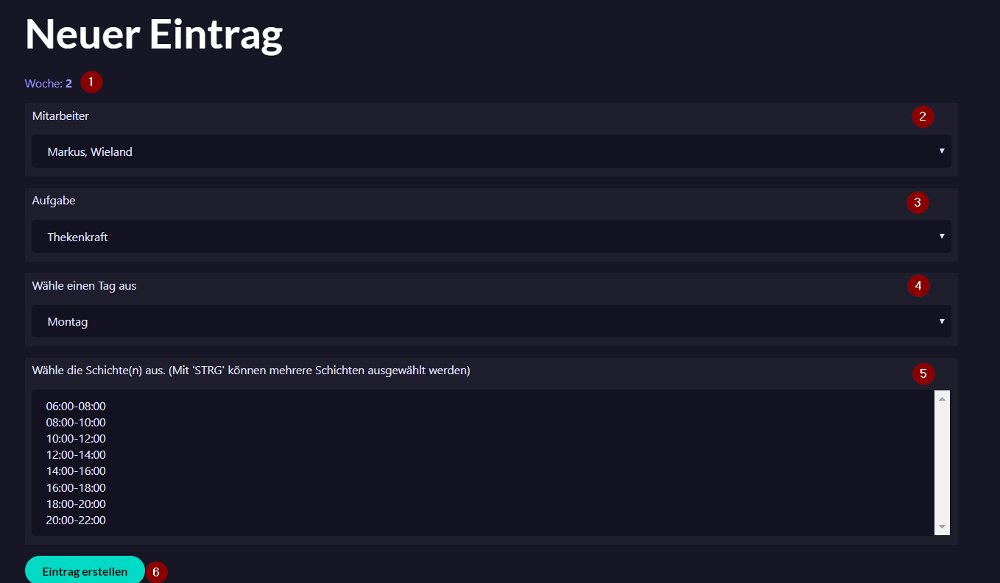

= Benutzerhandbuch

== Dienstplan
__Für dieses Feature benötigt man die Rolle "STAFF"__

=== Dienstplan Übersicht

1 ... siehe "Dienstplan filtern"

2 ... siehe "Dienstplan einer anderen Woche"

3 ... siehe "Diesntplaneintrag einsehen/bearbeiten/löschen"

4 ... siehe "Dienstplaneintrag erstellen"

5 ... Legende. Blaue Felder beschreiben Einträge mit der Rolle "Trainer", grüne beschreiben Einträge mit der Rolle "Thekenkraft".

=== Dienstplaneintrag erstellen

Um einen Eintrag zu erstellen, muss man zunächst den Dienstplan der enstprechenden Woche auswählen. Mehr dazu unter "Dienstplan einer anderen Woche".

Um nun einen neuen Dienstplaneintrag zu erstellen, drückt man auf den "Eintrag hinzufügen"-Button am Ende der Übersichtsseits. Dort gelangt man zu einem Formular.

In der ersten Zeile steht die ausgewählte Woche. (1) Diese kann hier nicht mehr bearbeitet werden. Wenn man eine andere Woche möchte, muss man diese zunächst in der Übersicht auswählen.

Als nächstes folgt eine Liste aller Mitarbeiter. Dort kann man einfach den gewünschten Mitarbeiter auswählen. (2) Diesem Mitarbeiter kann man mit der nächsten Liste eine Aufgabe zuordnen. (3)

Nun muss noch die Zeit ausgewählt werden. Die Woche ist wie oben beschrieben bereits festgelegt. Als nächstes wählt man einen Wochentag aus. (4) Man kann nicht mehrere Tage auf einmal auswählen. Was jetzt noch fehlt sind die bereits festgeschriebenen Arbeitszeiten (Schichten). (5) Mit STRG (oder SHIFT) + Linksklick könnenn mehrere Schichten auf einmal ausgewählt werden. 

Mit dem "Erstellen"-Button (6) wird der Eintrag erstellt.

__Sollte der Mitarbeiter zu dieser Zeit bereits arbeiten, wird kein Eintrag erstellt. Sollte man mehrere Zeiten ausgewählt haben, und der Mitarbeiter kann an einer/mehreren dieser Zeiten nicht, so werden alle Einträge bis auf die enstprechenden erstellt.__

Eine andere Möglichkeit einen Eintrag zu erstellen wird im Kapitel "Dienstplaneintrag Training zuordnen"

=== Dienstplaneintrag einsehen/bearbeiten/löschen

Details über einen Eintrag erhält man, in dem man auf den Eintrag im Dienstplan klickt.
Dort kann man auch den Eintrag bearbeiten/löschen.

Um die Änderungen zu speichern muss man auf den "Speichern"-Button drücken. Um einen Eintrag zu löschen muss man auf den "Löschen"-Button drücken. Gelöschte Einträge sind unwiderruflich gelöscht.

*Achtung*: Sollte dem Eintrag ein Training zu geordnet sein, so kann dieser Eintrag nicht bearbeitet/gelöscht werden. Um solche Einträge zu löschen muss das dazugehörige Training abgesagt werden.

=== Dienstplan filtern

Standardmäßig sieht man alle Einträge der ausgewählten Woche. Möchte man jedoch nur die Einträge von sich selbst, oder einem anderen Mitarbeiter sehen, gibt es im obenen Teil der Seite eine Liste mit allen Mitarbeitern.

Wählt man einen Mitarbeiter aus, werden alle Einträge von anderen Mitarbeitern unsichtbar gemacht.

image::user_guide/filter_roster.png[]

=== Dienstplan einer anderen Woche

Öffnet man den Dienstplan sieht man standardmäßig den Dienstplan der derzeitigen Woche.

Um den Dienstplan einer anderen Woche auszuwählen, befindet sich im oberen Teil der Seite eine Liste. Diese beinhaltet die Dienstpläne der nächste sechs Wochen. Durch drücken auf einen der Einträge gelangt man automatisch zu dem Dienstplan der entsprechenden (Kalender)Woche. Der standardmäßig ausgewählte Einträge der Liste repräsentiert die Kalenderwoche des ausgewählten Dienstplans.

=== Dienstplaneintrag Training zuordnen

Es ist nicht möglich manuell einem Dienstplaneintrag ein Training zu ordnen. Es ist nur möglich einen Mitarbeiter zu einer Zeit als Trainer einzuteilen. Wenn man ein Training annimmt, wird automatisch ein Eintrag im Dienstplan erstellt. Dieser enthält die Informationen über das Training. Nur auf diesen Weg kann ein Training zu einem Eintrag hinzugefügt werden.

Dieser Link ist nur bei Einträgen verfügbar, welche ein Training beinhalten.
